

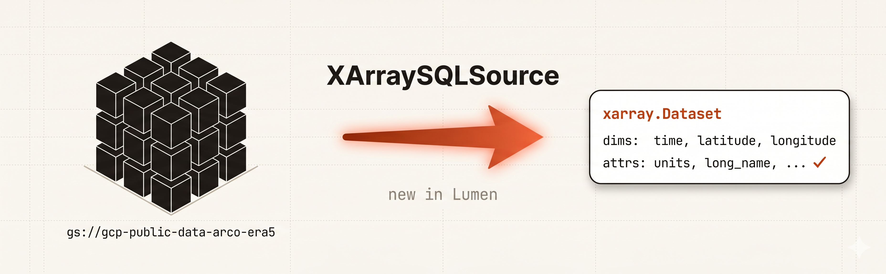{fig-align="center"}

Lumen is a SQL-first framework. That makes it natural for tabular
data and awkward for the multi-dimensional scientific datasets that
live in xarray. Until now, feeding an `xarray.Dataset` into a Lumen
pipeline meant flattening the cube to a pandas DataFrame and
watching the coordinates, units, and attributes evaporate on the way
in. The Dask graph behind a lazy Zarr disappeared with them.

Lumen has a proper Source for this: `XArraySQLSource`. It takes any
`xarray.Dataset`, registers each data variable as a SQL table with
its coordinate columns intact, and routes queries through
[xarray-sql](https://github.com/alxmrs/xarray-sql) and
[Apache DataFusion](https://github.com/apache/datafusion). NetCDF,
Zarr, HDF5 and GRIB all flow through `xr.open_dataset` automatically.
Cloud stores use the same anonymous fsspec credentials xarray
already accepts. Dask laziness carries from the underlying file
through DataFusion's query plan, so multi-million-row aggregations
stream instead of materialising the grid.

## A two-minute recap of Lumen AI

[Lumen](https://lumen.holoviz.org) is the declarative data
application framework in the HoloViz stack. Since the
[Lumen AI 1.0 release earlier this year](https://blog.holoviz.org/posts/lumen_1.0/),
the front door is a chat surface: you ask a question, a `Planner`
breaks it down, a `SourceAgent` picks the right data source, a
`SQLAgent` writes and runs the query, and a `ViewAgent` decides how
to draw the answer.

Every one of those agents speaks SQL. That is a clean model for
Postgres, DuckDB or BigQuery, and exactly the model that scientific
N-dimensional data sits awkwardly inside.

## The mismatch

A climate scientist has a NetCDF file: `2m_temperature` over latitude,
longitude and time. In xarray, that variable is a 4D array with
named dims (`time`, `latitude`, `longitude`), coordinate arrays with
units (`degrees_north`, `K`), and an `attrs` dict carrying things
like `long_name` and provenance. In SQL, the same data is a flat
table with columns `time, latitude, longitude, 2m_temperature` and
no awareness that those columns describe a regular grid.

Until now, the only way to feed an xarray dataset into a Lumen
`SQLTransform` was the lossy path: open with xarray, call
`.to_dataframe()`, hand the resulting `pandas.DataFrame` to Lumen.
The dims become regular columns. The coordinate units are gone. The
`attrs` are gone. The Dask graph that backed your lazy Zarr is gone.
Every downstream consumer now sees a flat table with no idea it
ever knew about coordinates.

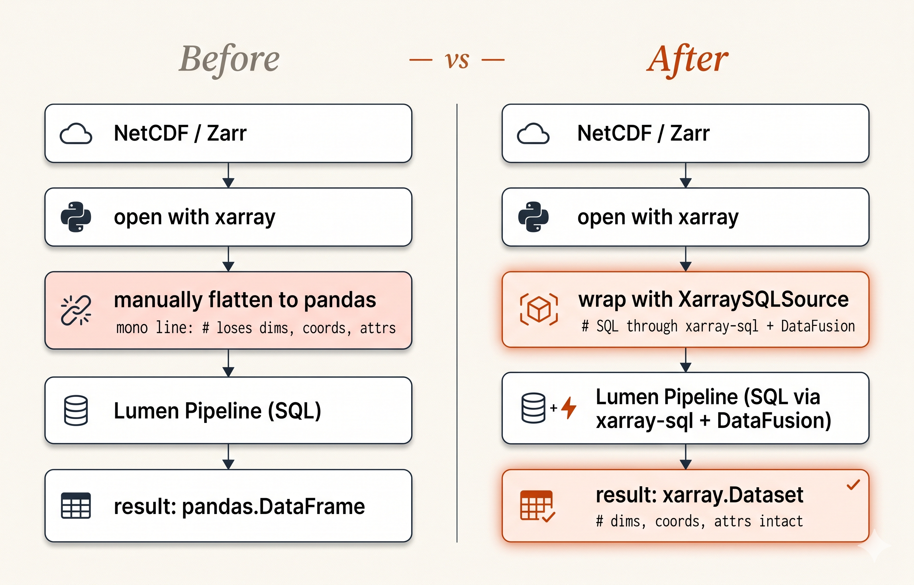{fig-align="center"}

The XArraySQLSource replaces that flattening step with a translator
that keeps the structure intact.

## What XArraySQLSource is

`XArraySQLSource` wraps any `xarray.Dataset`, either by URI:

```python
from lumen.sources.xarray_sql import XArraySQLSource

source = XArraySQLSource(
    uri="path/to/data.nc",   # or .zarr, .h5, .grib, or a gs://... URL
    engine="zarr",            # auto-detected from extension if omitted
    open_kwargs={"consolidated": True},
    chunks="auto",
)
```

or, when you already hold an opened `xarray.Dataset` (for example
from `xr.tutorial`, an intake catalog, or a `xarray-beam` pipeline),
through the `from_dataset` classmethod:

```python
import xarray as xr
ds = xr.tutorial.open_dataset("air_temperature")
source = XArraySQLSource.from_dataset(ds)
```

The two share the same downstream behaviour. On construction, the
source walks the dataset and registers every data variable as its
own SQL table with `xarray-sql`'s `XarrayContext`. Coordinate arrays
become regular columns of that table. Chunks are forwarded to
DataFusion so each query can process data lazily.

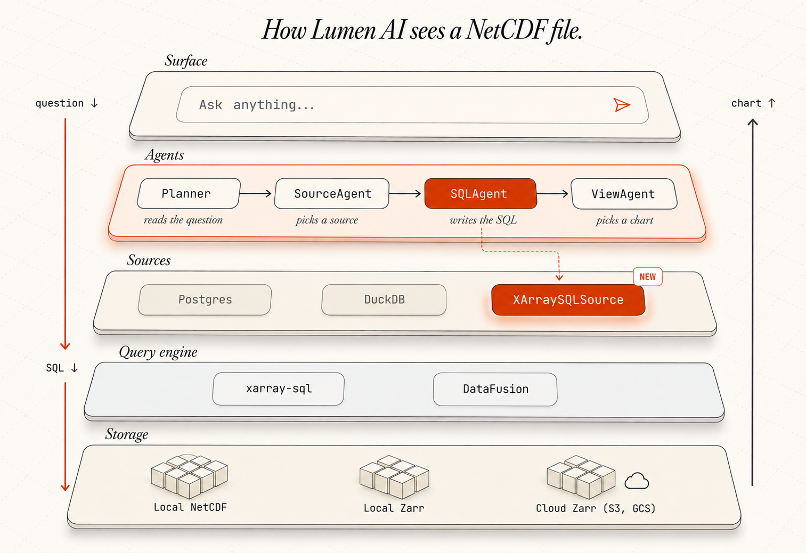{fig-align="center"}

Once the dataset is registered, the rest of Lumen treats the source
like any other SQL source. Schema introspection works the same way.
SQLTransforms compose against the registered table names. Filters
push predicates down. The Lumen UI sees the variables as queryable
tables and presents them through the same controls it uses for
DuckDB or Snowflake or BigQuery.

## A first look

Wrap a dataset, list the tables, run a query. Here is the standard
NCEP/NCAR reanalysis end to end:

{fig-align="center"}

The source reports a real schema with dtypes and human-readable
descriptions pulled straight from the xarray `attrs`. The Lumen
agent and the SQLTransform layer both consume it. The variable
name `air` becomes a SQL identifier, and the query above is plain
DataFusion SQL with no Lumen-specific syntax to learn.

Multi-variable datasets register everything in one pass. ERA-Interim's
bundled three-variable subset of zonal wind, meridional wind, and
geopotential becomes three SQL tables you can query independently:

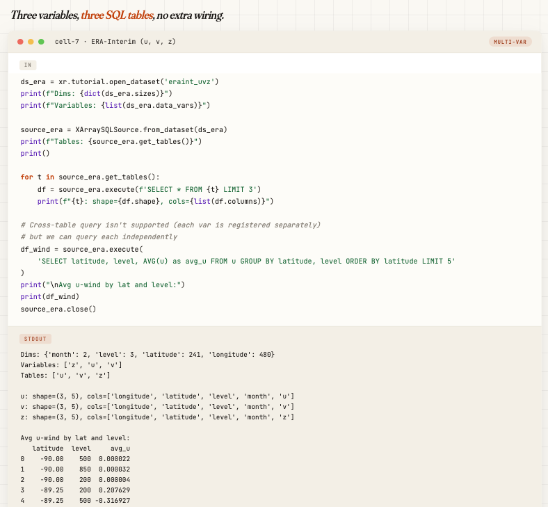{fig-align="center"}

Joins across variables are not in yet; each variable is its own
table. Per-variable queries with their own coordinate filters work
out of the box, and that covers most scientific exploration anyway.

## From a dropped file to a SQL agent

The Source is a Python class. Useful, but you reach for it
manually. The second half of the work is getting Lumen AI to grab
it for you when a scientific file shows up in the chat. That
landed in [`holoviz/lumen#1791`](https://github.com/holoviz/lumen/pull/1791),
184 added lines across six files, no new agent code, no new
prompts.

It sits in one upload handler. Every xarray-supported extension
(`nc`, `nc4`, `netcdf`, `h5`, `hdf5`, `he5`, `zarr`, `grib`,
`grib2`, `grb`, `grb2`) maps to a small helper that writes the
upload to a temp file, opens it with xarray, and wraps the result
in `XArraySQLSource`:

```python
# lumen/ai/ui.py (simplified)
@staticmethod
def _get_xarray_upload_handlers():
    def _handle_xarray_upload(context, file_obj, alias, filename):
        tmp = tempfile.NamedTemporaryFile(delete=False, suffix=...)
        tmp.write(file_obj.read())
        tmp.close()
        return XArraySQLSource(uri=tmp.name, name=alias)
    return {ext: _handle_xarray_upload for ext in XARRAY_EXTENSIONS}
```

That is the whole new wiring. Five stages, end to end:

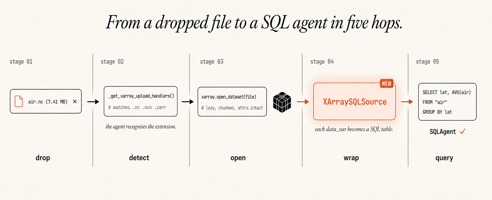{fig-align="center"}

Stages 02 to 04 are the new code; the rest of Lumen AI did not
change. Once the source is registered, the existing chain takes
over: `Planner` writes a checklist, `SourceAgent` confirms the
source, `SQLAgent` writes the query, `ViewAgent` picks a chart.
`XArraySQLSource` shows up to the rest of the system as one more
SQL source, the same way DuckDB or Postgres does.

Drop NCEP `air.nc` into the chat (7.4 MB, monthly mean air
temperature on a `time / lat / lon` grid). Ask a SQL-shaped
question:

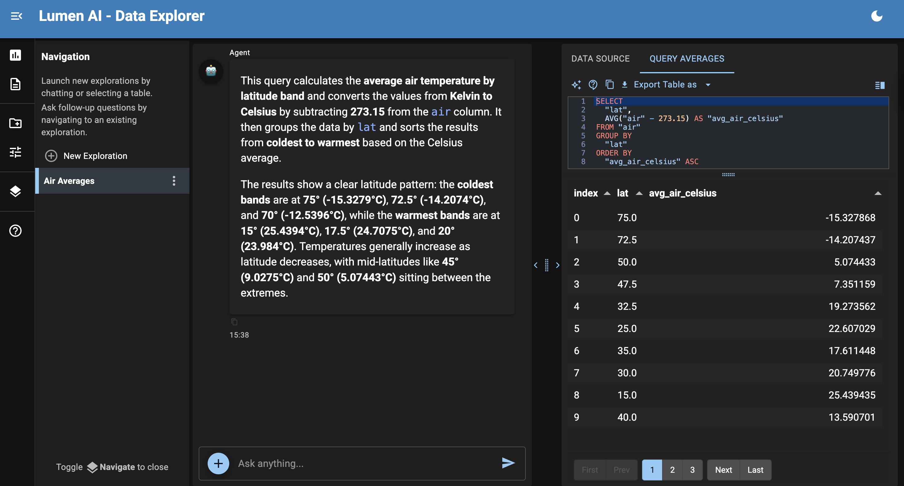{fig-align="center"}

Ask for a plot and `ViewAgent` picks the chart shape. A daily mean
over the whole domain comes back as a line:

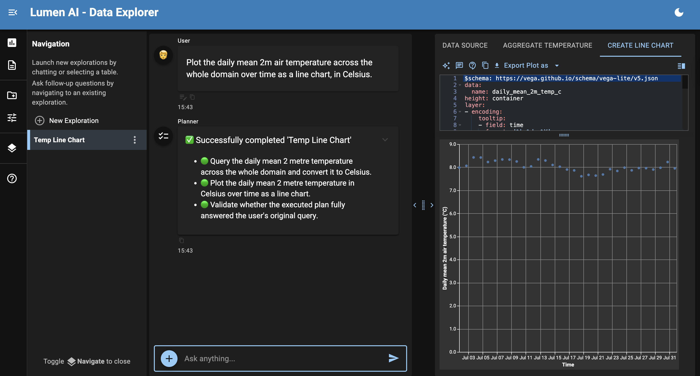{fig-align="center"}

Follow up with "turn this into a bar chart now" and the View
swaps without re-running the query:

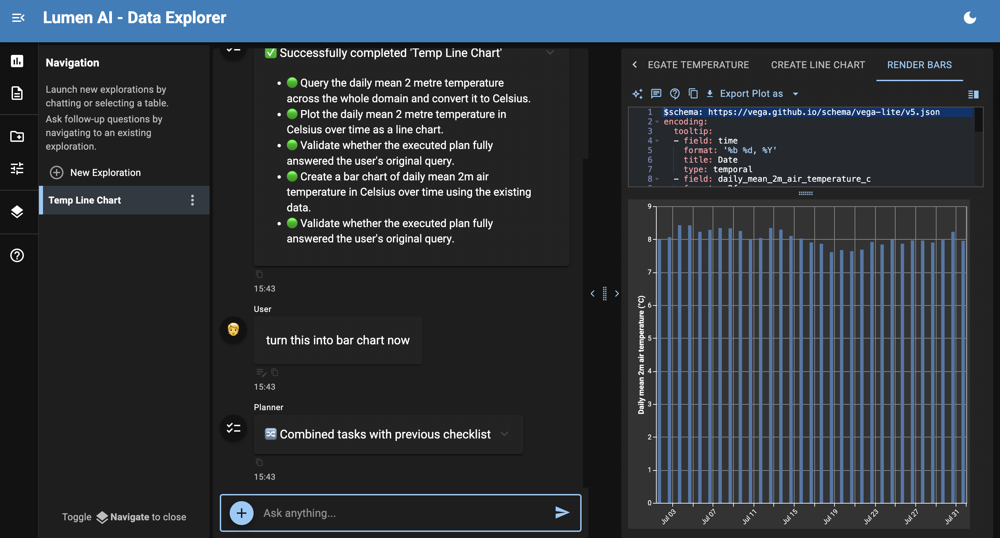{fig-align="center"}

Ask a shape question and it drops to a coordinate axis with no
extra hint:

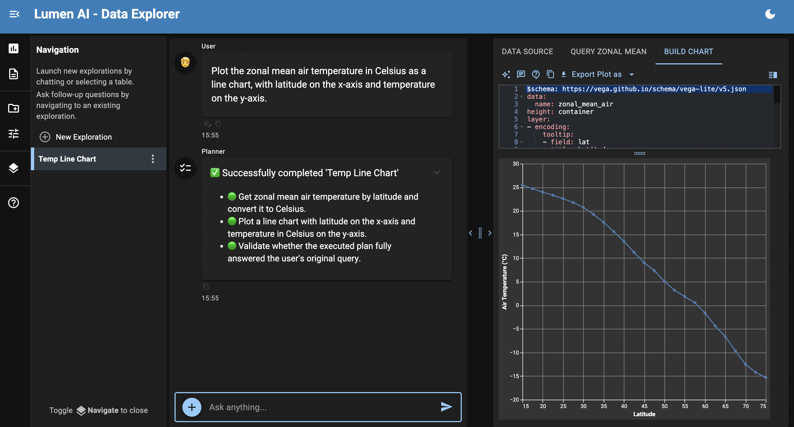{fig-align="center"}

A three-band comparison comes back as a three-line chart, with the
SQL filters carried into the legend:

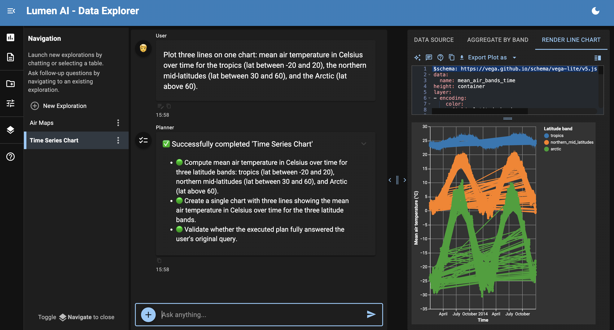{fig-align="center"}

Drop a different file in (ECMWF ERA-40 subset, two variables `t2m`
and `msl`) and the same chain handles it without ceremony. Spatial
questions land on a map:

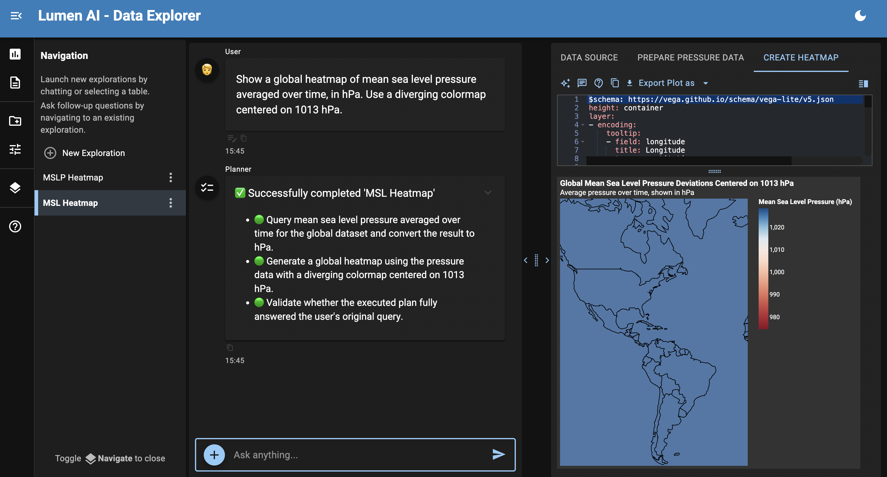{fig-align="center"}

Two questions in one query come back as one tidy table. Monthly
mean `t2m` in Celsius alongside monthly mean `msl` in hPa, joined
on the time axis:

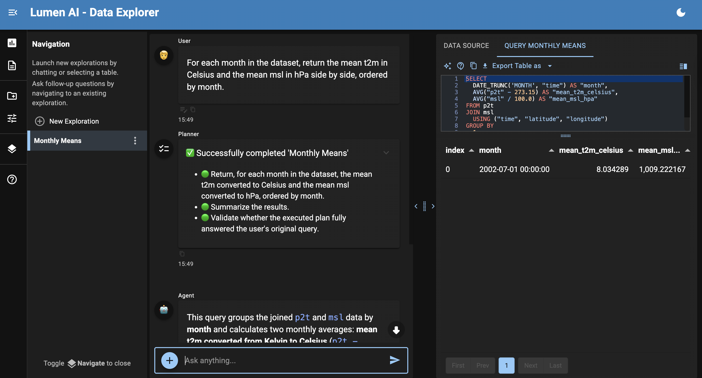{fig-align="center"}

Back on `air.nc`, the postcard frame is a Hovmöller of zonal mean
temperature across the year:

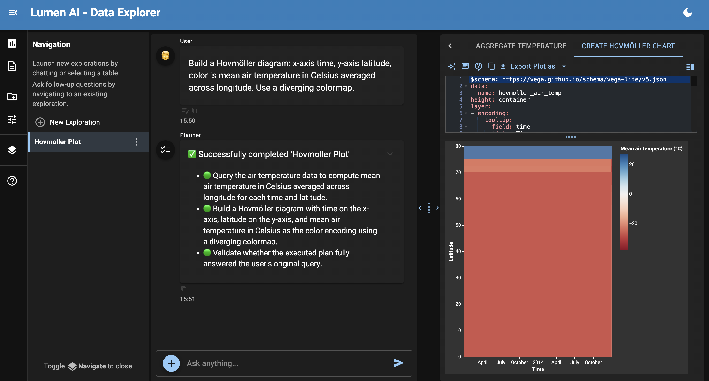{fig-align="center"}

None of these turns required hand-written SQL. None required
choosing a chart type. The data stayed in xarray until the final
hop into Vega-Lite. Same code path that handles a Postgres
connection now handles a 7 MB NetCDF on disk.

## Scale and shape

Does it hold up on real data, or does the source materialise the
whole grid?

DataFusion processes the registered xarray-backed tables lazily.
Aggregations, filters and projections push down through the chunk
graph. A 10 million row synthetic dataset on a laptop runs three
back-to-back queries (count, aggregation, filtered region) without
materialising:

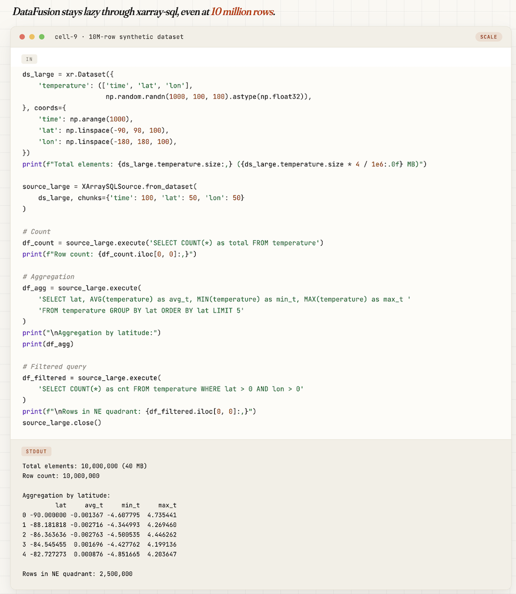{fig-align="center"}

On the cloud, the same code points at a Zarr URL with anonymous
credentials. ARCO-ERA5, the official Analysis-Ready Cloud-Optimized
ERA5 reanalysis hosted by ECMWF and Google Public Datasets, opens
in a few seconds:

```python
source = XArraySQLSource(
    uri="gs://gcp-public-data-arco-era5/co/single-level-reanalysis.zarr-v2",
    engine="zarr",
    open_kwargs={
        "consolidated": True,
        "storage_options": {"token": "anon"},
    },
    variables=["2m_temperature"],
)
```

A query for the monthly tropical mean over January through March 2020
is a plain SQL statement. DataFusion only reads the chunks that
intersect the WHERE clause:

```sql
SELECT
    DATE_TRUNC('month', "time")  AS month,
    AVG("2m_temperature")        AS mean_t2m_k
FROM "2m_temperature"
WHERE "latitude"  BETWEEN -10 AND 10
  AND "time"      BETWEEN '2020-01-01' AND '2020-04-01'
GROUP BY month
ORDER BY month
```

The result comes back as a tidy table with the coordinate columns
intact, and projecting it onto a map is the same one-liner you would
write against any tabular result:

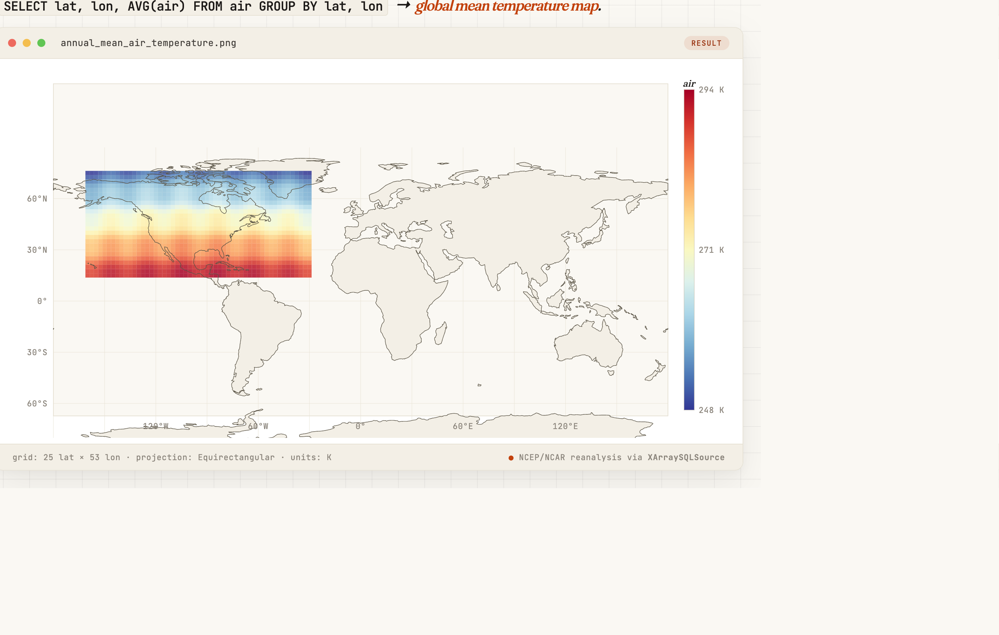{fig-align="center"}

The full pipeline (load, query, transform, visualize) was validated
across [seven dataset types and chunking edge cases](https://gist.github.com/ghostiee-11/42f42d6cfb2ce2c1ed4f68e7c1fe7671)
before the PR landed: NCEP, RASM with non-linear `xc/yc` coordinates,
ERA-Interim multi-variable, a 10M-row synthetic stress test, Zarr,
HDF5, and one documented upstream limit on mixed-dimension chunking.

## Where the metadata lives

`source.execute(sql)` returns a pandas DataFrame today. Coordinate
metadata does not ride along on that result. What does get
preserved, and where Lumen actually reads it from, is the source
schema.

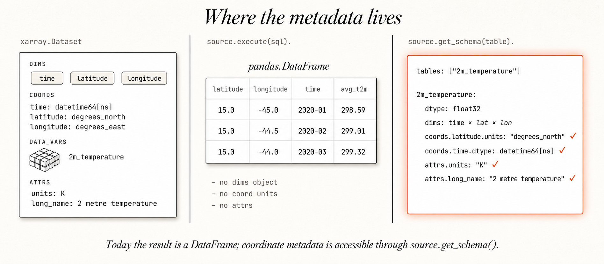{fig-align="center"}

In practice this means:

- **Dims** are exposed as named SQL columns, so a WHERE clause on
  `latitude` filters along the latitude axis. No need to remember
  which integer index corresponded to which physical coordinate.
- **Coordinate units** (`degrees_north`, `K`, `datetime64[ns]`),
  variable `dtype`, and `attrs` like `long_name` and
  `standard_name` are all accessible through
  `source.get_schema(table)`. The Lumen AI agent and downstream
  views consume them from there, not from the result DataFrame.
- **Dask laziness** carries from the underlying Zarr or NetCDF
  through xarray-sql into DataFusion's query plan. Filters push
  down, aggregations stream. The result is materialised to pandas
  only at the very end of the query.
- **What is not on the result today**: the `dims` object,
  coordinate units, and `attrs`. Those live on the source. The full
  Dataset round-trip, where a SQL result comes back as an
  `xarray.Dataset` with all coordinate metadata preserved on the
  result itself, is tracked upstream at
  [xarray-sql#58](https://github.com/alxmrs/xarray-sql/issues/58).

The deliberate non-goal here is to make xarray and SQL look like
the same thing. They are not. SQL is unaware of grid structure,
`Dataset.sel(time=..., lat=...)` is. The XArraySQLSource gives
Lumen a faithful SQL view of the data, with coordinate metadata
introspectable through the source, without pretending the
underlying representation is flat.

## Design decisions

Three choices in the source are worth calling out because each
opens or closes a future direction.

**Per-variable table registration.** A `Dataset` with three
variables becomes three SQL tables, not one wide one. DataFusion
expects each registered table to be rectangular, and a `Dataset`
can hold variables with different dims, so a single combined table
is not always definable. Splitting per variable also keeps the
schema readable and makes pushdown work cleanly. The trade-off is
that joins across variables are a separate problem to solve, and
right now you handle them in application code rather than in SQL.

**xarray-sql plus DataFusion under the hood.** xarray-sql is the
existing Apache project for SQL-on-xarray. DataFusion is a Rust
query engine with a Python binding, good predicate pushdown, and a
mature relational planner. The alternative was to lean on
DuckDB-on-pandas, which would have meant materialising every query
result into pandas. That foreclosure on lazy compute felt worse
than the cost of an additional dependency. xarray-sql also gives
Lumen a direct path to contribute upstream when the round-trip
back to `xarray.Dataset` lands ([xarray-sql#58](https://github.com/alxmrs/xarray-sql/issues/58)).

**`uri=` or `from_dataset()`, never both.** The constructor accepts
either a path the source opens itself, or a pre-opened Dataset
through the classmethod. The path keeps simple cases as a one-liner.
The classmethod keeps the door open for everything xarray ecosystem
people already do: pulling from intake catalogs, slicing in
xarray-beam pipelines, hand-constructing datasets. The two cases
share all the downstream code.

## Get started

Both pieces are in `holoviz/lumen` `main` today:

```bash
pip install lumen[xarray]
```

```python
from lumen.sources.xarray_sql import XArraySQLSource
```

Or open a chat surface, drop any xarray-readable file in, and start
asking questions. Lumen AI ships with
[LLM provider classes](https://lumen.holoviz.org/configuration/llm_providers/)
for OpenAI, Anthropic, Google, Mistral, AWS Bedrock, Azure OpenAI,
plus local runtimes (Llama.cpp, MLX, WebLLM) and a LiteLLM bridge
for everything else. Pick whichever you have a key for:

```bash
lumen-ai serve --provider <provider>
```

- Source code:
  [`lumen/sources/xarray_sql.py`](https://github.com/holoviz/lumen/blob/main/lumen/sources/xarray_sql.py).
- Source PR:
  [holoviz/lumen#1741](https://github.com/holoviz/lumen/pull/1741).
- AI wiring PR:
  [holoviz/lumen#1791](https://github.com/holoviz/lumen/pull/1791).
- Edge-case validation:
  [Gist of seven dataset shapes](https://gist.github.com/ghostiee-11/42f42d6cfb2ce2c1ed4f68e7c1fe7671)
  exercised during development (NCEP, RASM, ERA-Interim, a 10M-row
  stress test, Zarr, HDF5, and one documented upstream limit).
- Bug reports and feedback:
  [Lumen issue tracker](https://github.com/holoviz/lumen/issues).

### Credits

The source (`#1741`) and the AI wiring (`#1791`) were contributed
by [Aman Kumar](https://github.com/ghostiee-11) during Google
Summer of Code 2026, with HoloViz under the
[NumFOCUS](https://numfocus.org) umbrella. Design review and PR
feedback by [Andrew Huang](https://github.com/ahuang11) and
[Andy Maloney](https://github.com/amaloney).
