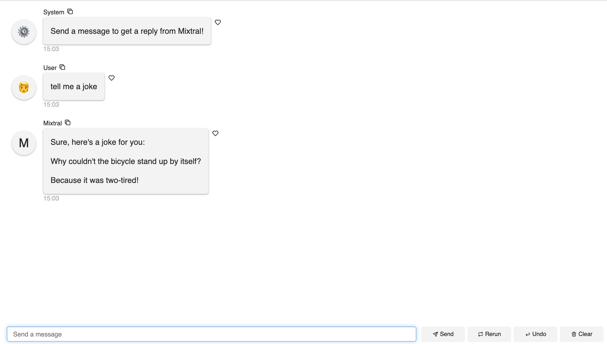
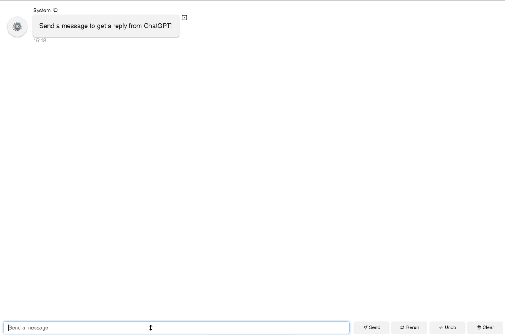

In this blog post, we'll explore how to build a simple AI chatbot, enhance it with memory capabilities, and finally, implement a feature to download conversations for further fine-tuning.

We will cover: 

- Getting started building a simple AI chatbot (with no memory)
- Adding memory to manage chat histories 
- Adding download button to download all conversations 


Before we get started, let's first make sure we install needed packages like `panel`, `mistralai`, `openai` in our Python environment and save our API keys as environment variables: 

`export MISTRAL_API_KEY="TYPE YOUR API KEY"`

`export OPENAI_API_KEY="TYPE YOUR API KEY"`

# Getting started building a simple AI chatbot (with no memory)

## Mistral models

In this blog post, we will only use the Mistral API. If you are interested in using Mistral models locally, check out our previous blog post [Build a Mixtral Chatbot with Panel](https://blog.holoviz.org/posts/mixtral/) to see how we used Mistral API, transformers, llama.cpp, and Panel to create AI chatbots that use the Mixtral 8x7B Instruct model. 

When we do not need to keep our conversation history, we are only sending one round of user message to model. Thus, in this example, the `messages` that get sent to the model are defined as `[ChatMessage(role="user", content=contents)]`. 

```python
import os
import panel as pn
from mistralai.async_client import MistralAsyncClient
from mistralai.models.chat_completion import ChatMessage

pn.extension()


async def callback(contents: str, user: str, instance: pn.chat.ChatInterface):
    model = "mistral-small"
    messages = [
        ChatMessage(role="user", content=contents)
    ]
    response = client.chat_stream(model=model, messages=messages)

    message = ""
    async for chunk in response:
        part = chunk.choices[0].delta.content
        if part is not None:
            message += part
            yield message


client = MistralAsyncClient(api_key=os.environ["MISTRAL_API_KEY"])
chat_interface = pn.chat.ChatInterface(callback=callback, callback_user="Mixtral")
chat_interface.send(
    "Send a message to get a reply from Mixtral!", user="System", respond=False
)
chat_interface.servable()
```



## OpenAI models
The code of using OpenAI models looks very similar. We are using OpenAI's API with async/await to use the asynchronous client. To use async, we simply import `AsyncOpenAI` instead of `OpenAI` and add `await` with the API call. 

```python
import panel as pn
from openai import AsyncOpenAI

pn.extension()


async def callback(contents: str, user: str, instance: pn.chat.ChatInterface):
    messages = [{"role": "user", "content": contents}]
    response = await aclient.chat.completions.create(
        model="gpt-3.5-turbo",
        messages=messages,
        stream=True,
    )
    message = ""
    async for chunk in response:
        part = chunk.choices[0].delta.content
        if part is not None:
            message += part
            yield message


aclient = AsyncOpenAI()
chat_interface = pn.chat.ChatInterface(callback=callback, callback_user="ChatGPT")
chat_interface.send(
    "Send a message to get a reply from ChatGPT!", user="System", respond=False
)
chat_interface.servable()
```

# Adding memory to manage chat histories 
`instance.serialize()` exports the chat log. Thus, if we'd like to pass all the chat history to our models, we can change the `messages` to the following: 

```python
messages = [
    ChatMessage(role=message["role"], content=message["content"])
    for message in instance.serialize()[1:]
]
```

`[1:]` means that we are skipping the first message. You can change, filter, and adapt the chat history to your use cases. `instance.serialize()` gives you the power to access all the chat logs. 

## Mistral models 
```python

import os
import panel as pn
from mistralai.async_client import MistralAsyncClient
from mistralai.models.chat_completion import ChatMessage

pn.extension()


async def callback(contents: str, user: str, instance: pn.chat.ChatInterface):
    model = "mistral-small"
    messages = [
        ChatMessage(**message)
        for message in instance.serialize()[1:]
    ]
    response = client.chat_stream(model=model, messages=messages)

    message = ""
    async for chunk in response:
        part = chunk.choices[0].delta.content
        if part is not None:
            message += part
            yield message


client = MistralAsyncClient(api_key=os.environ["MISTRAL_API_KEY"])
chat_interface = pn.chat.ChatInterface(callback=callback, callback_user="Mixtral")
chat_interface.send(
    "Send a message to get a reply from Mixtral!", user="System", respond=False
)
chat_interface.servable()
```

Here in this example, the model indeed knows what we were talking about previously. 


## OpenAI models
The code for OpenAI models is even simpler. Simply change `messages` to `instance.serialize()[1:]`, you will send all the chat history except for the first message to OpenAI API. 

```python
import panel as pn
from openai import AsyncOpenAI

pn.extension()


async def callback(contents: str, user: str, instance: pn.chat.ChatInterface):
    messages = instance.serialize()[1:]
    response = await aclient.chat.completions.create(
        model="gpt-3.5-turbo",
        messages=messages,
        stream=True,
    )
    message = ""
    async for chunk in response:
        part = chunk.choices[0].delta.content
        if part is not None:
            message += part
            yield message


aclient = AsyncOpenAI()
chat_interface = pn.chat.ChatInterface(callback=callback, callback_user="ChatGPT")
chat_interface.send(
    "Send a message to get a reply from ChatGPT!", user="System", respond=False
)
chat_interface.servable()
```




# Adding download button to download all conversations 
What if you'd like download all the conversations and chat histories? What if you would like to use your chat history for fine-tuning? You can add a download button to download all conversations. 


## Mistral models
What we are adding here the `file_download` widget. When we click this button, it will execute the `download_history` function, which just dump our chat history (`chat_interface.serialize()`) into a json file and save into the `history.json` file. 

The output is a well-formatted json file that can easily be used for future model fine-tuning. 

```python
import os
import panel as pn
from mistralai.async_client import MistralAsyncClient
from mistralai.models.chat_completion import ChatMessage
from io import StringIO
import json

pn.extension()


async def callback(contents: str, user: str, instance: pn.chat.ChatInterface):
    model = "mistral-small"
    messages = [
        ChatMessage(**message)
        for message in instance.serialize()[1:]
    ]
    print(messages)
    response = client.chat_stream(model=model, messages=messages)

    message = ""
    async for chunk in response:
        part = chunk.choices[0].delta.content
        if part is not None:
            message += part
            yield message

def download_history():
   buf = StringIO()
   json.dump(chat_interface.serialize(), buf)
   buf.seek(0)
   return buf

file_download = pn.widgets.FileDownload(
   callback=download_history, filename="history.json"
)
header = pn.Row(pn.HSpacer(), file_download)


client = MistralAsyncClient(api_key=os.environ["MISTRAL_API_KEY"])
chat_interface = pn.chat.ChatInterface(
    callback=callback, 
    callback_user="Mixtral",
    header=header
    )
chat_interface.send(
    "Send a message to get a reply from Mixtral!", user="System", respond=False
)
chat_interface.servable()
```

## OpenAI models
Adding exactly the same code, we can also easily download all conversation with OpenAI models: 

```python
import panel as pn
from openai import AsyncOpenAI
from io import StringIO
import json

pn.extension()


async def callback(contents: str, user: str, instance: pn.chat.ChatInterface):
    messages = instance.serialize()[1:]
    response = await aclient.chat.completions.create(
        model="gpt-3.5-turbo",
        messages=messages,
        stream=True,
    )
    message = ""
    async for chunk in response:
        part = chunk.choices[0].delta.content
        if part is not None:
            message += part
            yield message

def download_history():
   buf = StringIO()
   json.dump(chat_interface.serialize(), buf)
   buf.seek(0)
   return buf

file_download = pn.widgets.FileDownload(
   callback=download_history, filename="history.json"
)
header = pn.Row(pn.HSpacer(), file_download)

aclient = AsyncOpenAI()
chat_interface = pn.chat.ChatInterface(
    callback=callback, 
    callback_user="ChatGPT",
    header=header
    )
chat_interface.send(
    "Send a message to get a reply from ChatGPT!", user="System", respond=False
)
chat_interface.servable()
```


# Conclusion
In this blog post, we learned two simple tips in building a Panel AI dashboard: how to add memory to pass past conversation to the language models, and how to download our conversation with the models.


If you are interested in learning more about how to build AI chatbots in Panel, please read our related blog posts: 

- [Build a Mixtral Chatbot with Panel](https://blog.holoviz.org/posts/mixtral/)
- [Building AI Chatbots with Mistral and Llama2](https://medium.com/@sophiamyang/building-ai-chatbots-with-mistral-and-llama2-9c0f5abc296c) 
- [Building a Retrieval Augmented Generation Chatbot](https://medium.com/@sophiamyang/building-a-retrieval-augmented-generation-chatbot-d567a24fcd14)
- [How to Build Your Own Panel AI Chatbots](https://medium.com/@sophiamyang/how-to-build-your-own-panel-ai-chatbots-ef764f7f114e)
- [Build a RAG chatbot to answer questions about Python libraries](https://blog.holoviz.org/posts/fleet_ai/)
- [Build an AI Chatbot to Run Code and Tweak plots](https://blog.holoviz.org/posts/tweak-mpl-chat/)

If you find Panel useful, please consider giving us a star on Github ([https://github.com/holoviz/panel](https://github.com/holoviz/panel)). If you have any questions, feel free to ask on our [Discourse](https://discourse.holoviz.org/). Happy coding! 

