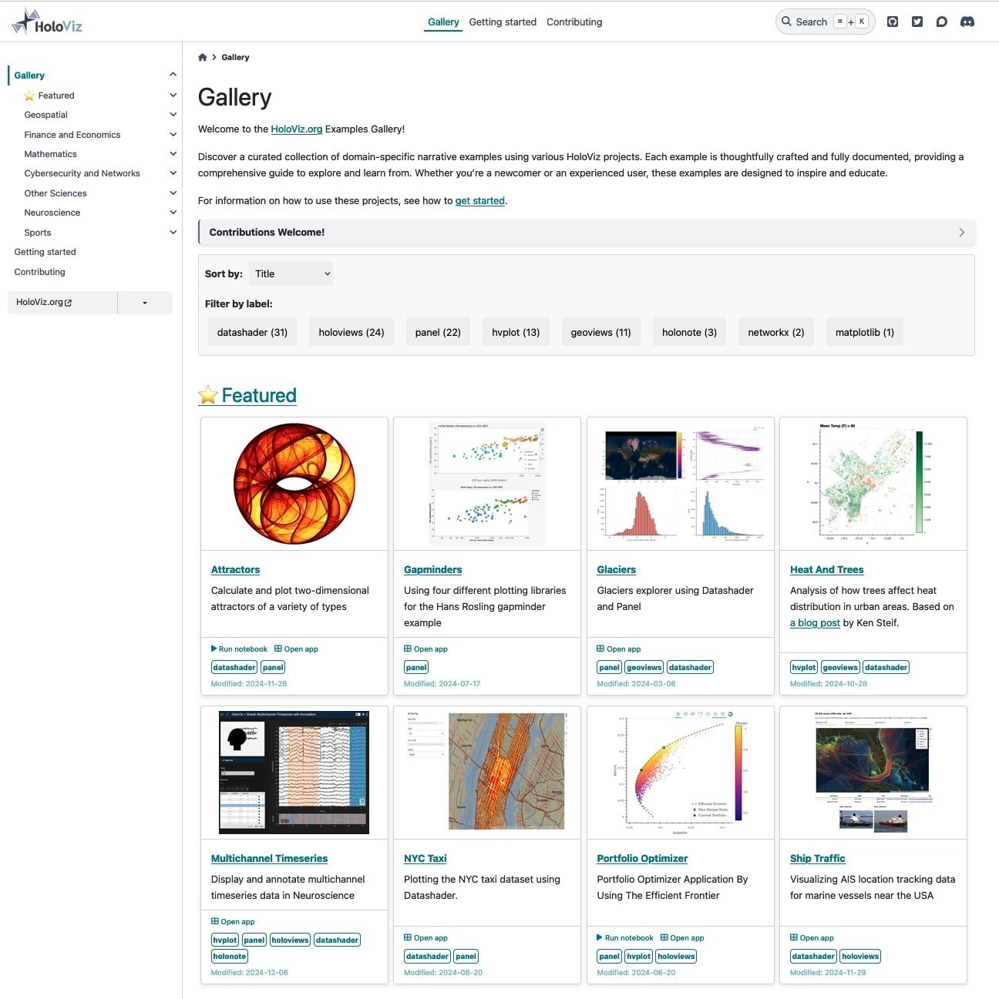
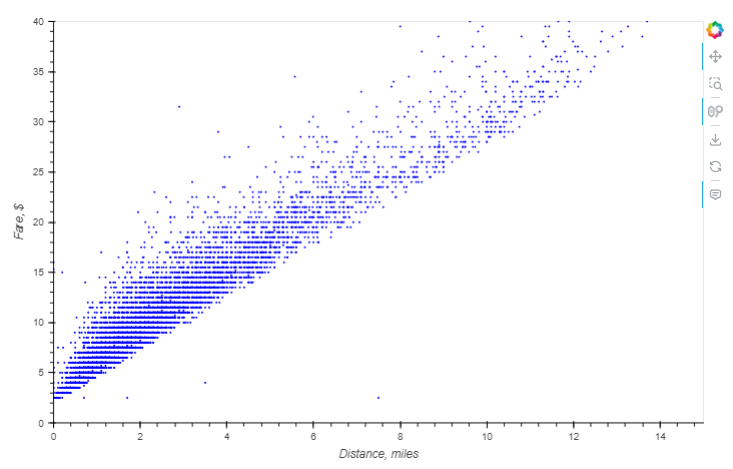
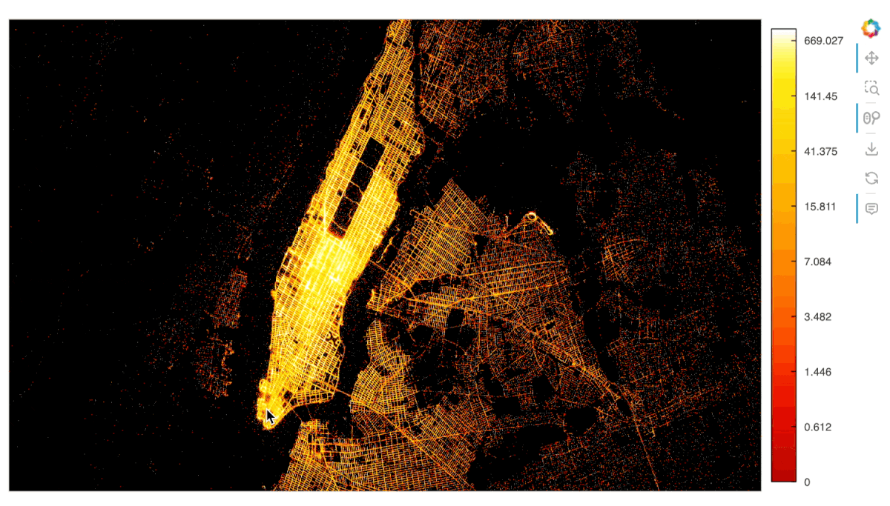
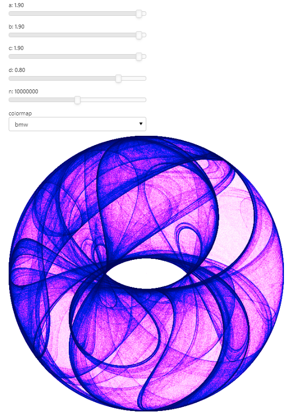
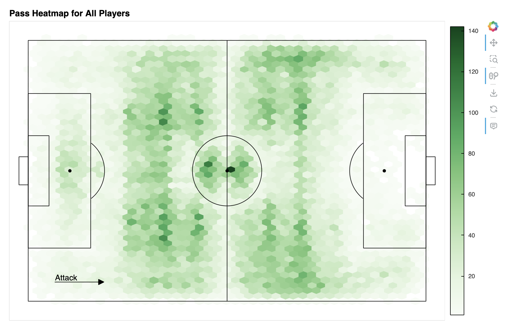

## HoloViz: Simplifying Data Visualization

[HoloViz](https://holoviz.org){.external target="_blank"} is a collection of open-source tools designed to make Python data visualization easier and more powerful. It includes tools like [Panel](https://panel.holoviz.org){.external target="_blank"}, [hvPlot](https://hvplot.holoviz.org){.external target="_blank"}, [HoloViews](https://holoviews.org){.external target="_blank"}, and [Datashader](https://datashader.org){.external target="_blank"}. Most tools have their own gallery, such as the [Panel App Gallery](https://panel.holoviz.org/gallery/index.html){.external target="_blank"} or the [HoloViews Gallery](https://holoviews.org/gallery/index.html){.external target="_blank"}, which focus on their specific features and APIs.

The [HoloViz Examples Gallery](https://examples.holoviz.org/){.external target="_blank"} is different. It showcases more than 40 **real-world examples** that combine multiple HoloViz tools into domain-specific workflows. These examples go beyond demonstrating individual tools—they tell data stories. This makes it easier to understand how to use the tools together and apply them to practical problems.

The Examples Gallery isn’t just a learning resource. It’s also a great way for users to contribute to HoloViz. By bringing their domain expertise, contributors can add new examples that reflect unique use cases and ideas. Updated examples, better contributor guides, and a clear process for adding content make it easier than ever to join the HoloViz community.

Thanks to a [NumFocus](https://numfocus.org/){.external target="_blank"} small development grant, we’ve made significant improvements to the Examples Gallery, and we’re excited to share the details in this blog post.

[](https://examples.holoviz.org){.external target="_blank"}

### What Makes the Examples Gallery Special?

- **Run Anywhere:** Each example is available as an `anaconda-project`[^1] zip file, so you can run it with the correct dependencies and datasets on any platform. Learn how [here](https://examples.holoviz.org/getting_started.html#run-locally){.external target="_blank"}.
- **Interactive Options:** Most examples include a read-only notebook ([try one](https://world-cup-notebook.holoviz-demo.anaconda.com/notebooks/world_cup.ipynb){.external target="_blank"}) or an interactive Panel app ([try one](https://world-cup.holoviz-demo.anaconda.com/){.external target="_blank"}). These let you explore interactively, even when full interactivity isn’t possible on the static site. Thanks to [Anaconda](https://www.anaconda.com/){.external target="_blank"} for hosting these!

Maintaining a large and complex collection of examples is a big challenge for an open-source team. Over time, the gallery became outdated, relying on tools and APIs that no longer reflected best practices. Updating the infrastructure was straightforward, but refreshing the content took much more work. That’s why we applied for a [NumFocus Small Development Grant](https://numfocus.org/programs/small-development-grants){.external target="_blank"} in late 2022, to modernize the gallery and bring in new contributors.

With the $10,000 grant awarded in early 2023, two new contributors, [Isaiah](https://github.com/azaya89){.external target="_blank"} and [Jason](https://github.com/jtao1){.external target="_blank"}, joined the project. Together, they tackled these goals:

- Update high-priority examples to reflect current best practices
- Improve and simplify contributor guidelines
- Organize examples into categories for easier navigation
- Add new examples to highlight underrepresented domains

Using a [detailed checklist](https://github.com/holoviz-topics/examples/wiki/Example-Modernization-Checklist-(2024)){.external target="_blank"}, Jason and Isaiah—mentored by Demetris and Maxime and supported by critical feedback from other members of the HoloViz team (Jim, Philipp, Simon, and Andrew)—updated and modernized [15 examples](https://github.com/holoviz-topics/examples/pulls?q=is%3Apr+label%3A%22NF+SDG%22+){.external target="_blank"}. Their work included restructuring examples, enhancing UIs, updating dependencies, and adopting modern APIs. In the rest of this post, we’ll focus on how they improved the APIs.


## Modernization: APIs

### [Plotting API: Prioritize hvPlot over HoloViews](https://holoviz.org/learn/background.html){.external target="_blank"}

Many examples were created before hvPlot was available or mature enough to use. hvPlot offers a simple, Pandas- and Xarray-friendly interface while exposing many capabilities offered by other HoloViz tools. In many cases, we replaced HoloViews code with hvPlot for its accessibility and ease of use. However, hvPlot isn’t a universal replacement—features like complex interactivity (e.g., linked selections, streams) are still exclusive to HoloViews.

For instance, the [NYC Taxi example](https://examples.holoviz.org/gallery/nyc_taxi/index.html){.external target="_blank"} creates a scatter plot to see the relationship between distance and fare cost. The modernized version uses hvPlot for clarity and simplicity.

**Original code:**
```python
scatter = hv.Scatter(samples, 'trip_distance', 'fare_amount')
labelled = scatter.redim.label(trip_distance="Distance, miles", fare_amount="Fare, $") 
labelled.redim.range(trip_distance=(0, 20), fare_amount=(0, 40)).opts(size=5)
```

**Modernized code:**
```python
samples.hvplot.scatter(
    'trip_distance', 'fare_amount', xlabel='Distance, miles',
    ylabel='Fare, $', xlim=(0, 20), ylim=(0, 40), s=5,
)
```




### Large Data Rendering: Prioritize `rasterize` over `datashade` for Bokeh Plots

`rasterize` and `datashade` are HoloViews operations powered by Datashader, designed to handle large datasets by transforming elements into images where each pixel represents an aggregate of the underlying data. While both are essential for visualizing large data, they differ in functionality and use cases.

- `datashade`: Produces an RGB image that is sent directly to the front-end (browser) and displayed as is. This approach offers fast rendering but limits interactivity, such as hover tooltips or color bars, because the raw data is not available to the plotting library.
- `rasterize`: Generates a multidimensional array of aggregated data, which is sent to the front-end for further processing, such as applying colormaps. Although this requires more work from Bokeh, it allows for richer interactivity, including hover information and client-side color bars.

Due to these advantages, `rasterize` is now the recommended choice for most large dataset visualizations. Ongoing development continues to expand its capabilities and improve its integration across the HoloViz stack when using Bokeh as the plotting backend.

For example, the [NYC Taxi example](https://examples.holoviz.org/gallery/nyc_taxi/nyc_taxi.html#million-point-datashaded-plots-interactive){.external target="_blank"} demonstrates how `rasterize` can render 10 million data points interactively. The plot shows drop-off locations, with passenger counts aggregated per pixel and displayed on hover.

**Modernized code:**
```python
df.hvplot.points(
    'dropoff_x', 'dropoff_y', rasterize=True, dynspread=True,
    aggregator=ds.sum('passenger_count'), cnorm='eq_hist', cmap=cc.fire[100:],
    xaxis=None, yaxis=None, width=900, height=500, bgcolor='black',
)
```




### [Interactivity API: Prioritize pn.bind()](https://panel.holoviz.org/tutorials/basic/pn_bind.html){.external target="_blank"}

Over the years, Panel has introduced [multiple interactive APIs](https://panel.holoviz.org/explanation/index.html#apis){.external target="_blank"}, and choosing the right one can be challenging. As the package has matured and user-feedback incorporated, `pn.bind()` has become the preferred option for linking widgets to functions while offering flexibility and a cleaner syntax over `pn.interact()` (deprecated), `@pn.depends()`, or `.param.watch()` for most use cases.

Importantly, exceptions remain, such as the recommendation to use `@param.depends()` to decorate methods for applications built with `param.Parameterized` classes, or using `.param.watch()` for more fine-grained control. Additionally, the [Portfolio Optimizer example](https://examples.holoviz.org/gallery/portfolio_optimizer/portfolio_optimizer.html#all-optimal-portfolios-efficient-frontier){.external target="_blank"} demonstrates the use of the new [reactive expression API (`.rx`)](https://panel.holoviz.org/tutorials/basic/pn_rx.html){.external target="_blank"}, which extends `pn.bind()` and the deprecated `pn.interact()` for reactive programming. This experimental `.rx` API is a promising addition, and we encourage users to explore it and share feedback.

In the [Attractors example](https://examples.holoviz.org/gallery/attractors/clifford_panel.html){.external target="_blank"}, we updated the code by replacing the deprecated `pn.interact()` with `pn.bind()`. This modernized approach explicitly links widgets to a function that plots an attractor using Datashader.


Original code:
```python
pn.interact(clifford_plot, n=(1,20000000), colormap=ps)
```

Modernized code: 
```python
widgets = {
    'a': pn.widgets.FloatSlider(value=1.9, end=2.0, step=0.1, name='a'),
    'b': pn.widgets.FloatSlider(value=1.9, end=2.0, step=0.1, name='b'),
    'c': pn.widgets.FloatSlider(value=1.9, end=2.0, step=0.1, name='c'),
    'd': pn.widgets.FloatSlider(value=0.8, end=1.0, step=0.1, name='d'),
    'n': pn.widgets.IntSlider(value=10000000, start=1000, end=20000000, step=100, name='n'),
    'colormap': pn.widgets.Select(value=ps['bmw'], options=ps, name='colormap'),
}

bound_clifford_plot = pn.bind(clifford_plot, **widgets)
pn.Column(*widgets.values(), bound_clifford_plot)
```



## Improved contributor guide

To support the modernization efforts and encourage new contributions, the contributor guide was updated to reflect the changes in infrastructure. The guide now provides clearer instructions and step-by-step guidance for new users to create and contribute examples to the gallery.

To make the process even more accessible, Isaiah created a detailed video tutorial that walks through each step of contributing a new example.



## New Example: FIFA World Cup 2018

Driven by his passion for football (soccer), Isaiah contributed an exciting example analyzing data from the FIFA World Cup 2018 tournament. This example delves into the performances of iconic players like Kylian Mbappe and Lionel Messi during the event.

You can explore the example in multiple ways:

- [View the example's page](https://examples.holoviz.org/gallery/world_cup/world_cup.html){.external target="_blank"}
- [Run the notebook live](https://world-cup-notebook.holoviz-demo.anaconda.com/notebooks/world_cup.ipynb){.external target="_blank"}
- [Interact with the Panel app](https://world-cup.holoviz-demo.anaconda.com/world_cup){.external target="_blank"}

[](https://examples.holoviz.org/gallery/world_cup/world_cup.html)


## Reflections

### [Jason’s](https://github.com/jtao1){.external target="_blank"} Reflections

Contributing to the revitalization of the examples website was an enlightening experience for me. Beyond learning about HoloViz tools, I gained a deeper understanding of open source contributions, including the workflow intricacies. This includes creating pull requests when making new changes or opening a new issue to document bugs found in the examples. Neither of which I’ve used when developing my own projects. Setting up the environment was also a tricky process as I had to do it in WSL. This exposure to WSL has helped me when working with other projects that are required to be using Linux. 

Overall, I am thankful to have been given this experience as a contributor as I’ve acquired a fundamental understanding of the tools that could be used.

### [Isaiah’s](https://github.com/Azaya89){.external target="_blank"} Reflections

Working on this project has not only been an enjoyable experience but also an incredibly educational one. The journey began with a steep learning curve, but overcoming those initial challenges has made the entire process more rewarding.

**Key Learnings**

*Panel and HoloViz Libraries*

The Panel and HoloViz libraries were at the core of our project. Panel, being a high-level app and dashboarding solution for Python, allowed us to create interactive visualizations effortlessly. HoloViz, with its suite of tools designed to work seamlessly together, made data visualization tasks more intuitive and efficient. These tools have significantly enhanced my ability to create compelling and interactive data visualizations.

*Datashader*

Modernizing examples using the Datashader library was one of the highlights of the project. Datashader excels at creating meaningful visualizations from large datasets, a critical capability in the age of big data. My extensive use of Datashader has turned it into a reliable tool that I now feel confident using for future projects.

*Anaconda-Project*

Another crucial aspect of the project was mastering anaconda-project. It facilitated managing project dependencies and environments, ensuring that the project was reproducible at various levels. This experience underscored the [importance of reproducibility in data science](https://www.anaconda.com/blog/8-levels-of-reproducibility), which is vital for collaboration and long-term project sustainability.

**Overcoming Challenges**

The initial phase was riddled with challenges, particularly in setting up the project locally and navigating the submission process for Pull Requests. The support from the project leaders was invaluable. Their guidance helped streamline our workflow, making subsequent tasks more manageable and efficient. This collaborative effort not only improved my technical skills but also reinforced the importance of teamwork and effective communication.

**Future Prospects**

This project has been a significant milestone in my career. Working with the HoloViz team has not only broadened my technical expertise but also inspired me to continue exploring and utilizing these tools. I am excited to integrate HoloViz and its associated libraries into my future personal and professional data science endeavors.

This project has been an enriching experience, providing both challenges and opportunities for growth. The skills and knowledge gained will undoubtedly influence my future work, and I am grateful for the chance to contribute to such a dynamic and innovative project.

### Demetris and Maxime's reflections

We want to thank Jason and Isaiah for the incredible effort they put into this project. As early-career developers, they took on a complex task—working with HoloViz’s expansive ecosystem—and did a great job making meaningful contributions. It’s not easy to navigate so many tools, APIs, and evolving documentation, but they approached the challenge with curiosity and determination.

Along the way, they helped us identify gaps in our APIs and brought fresh perspectives to our discussions about user experience. Their insights sparked conversations that led to improvements not just in the examples, but across HoloViz tools. We also appreciated their patience and adaptability as we all worked together to smooth out the edges of our first project funded by a NumFocus grant.

This collaboration wasn’t just about the examples—they’ve made lasting contributions to the ecosystem and the community. We’re excited to see where their journeys take them next. Jason and Isaiah, thank you for your hard work!

[^1]: `anaconda-project` is a project management tool created in 2016 and that predates most (if not all!) of the tools of this type like Poetry, Hatch, PDM,  Pixi, conda-project, etc. It is no longer maintained and we do not recommend adopting it, some day we'll migrate to another tool.
