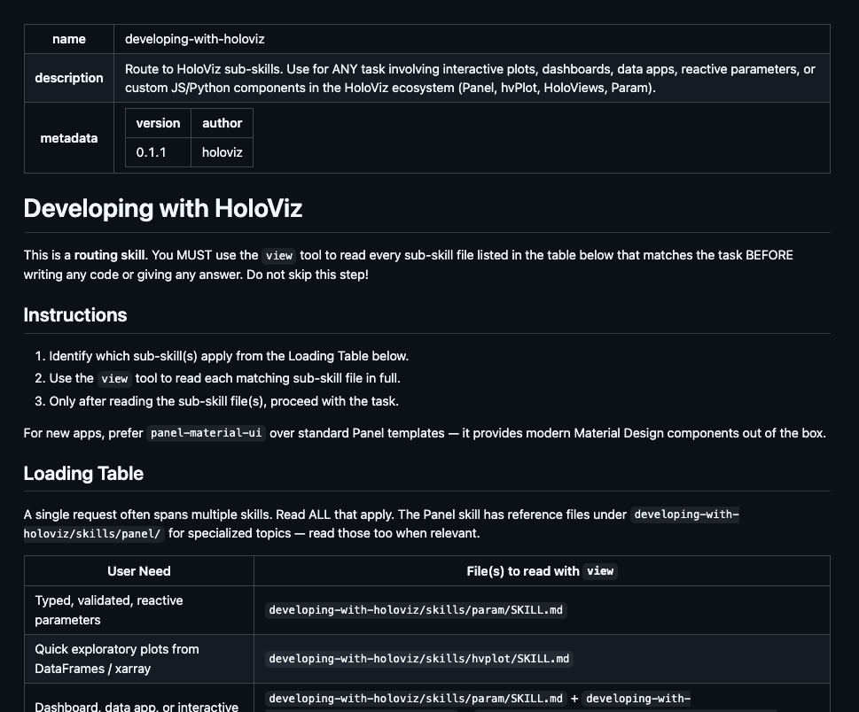
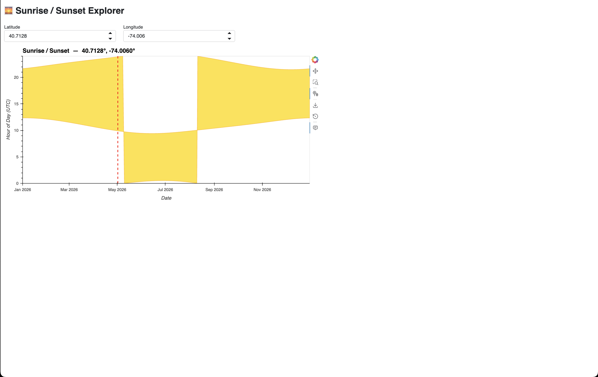
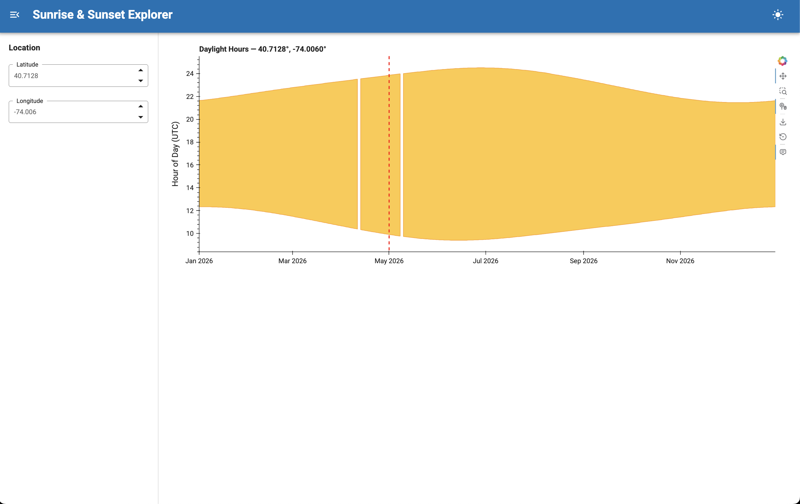

## Introduction
Over the past several months, our team has been investigating a question that many open-source projects are now facing:

“How can we help AI coding assistants produce better results when working with the HoloViz ecosystem?”

As AI-assisted development becomes more common, users are increasingly relying on tools such as GitHub Copilot, Claude Code, Cursor, and others to learn libraries, generate apps, and solve problems. The quality of those experiences depends heavily on the information available to the model and how that information is presented.

Our goal is to make the models generate more accurate, maintainable, and idiomatic HoloViz code while at the same time help users avoid common mistakes.

## Problem Formulation
The first phase of the project was spent researching how large language models (LLMs) currently interact with the HoloViz libraries and identifying recurring failure modes. Some of the issues were already familiar, such as hallucinated APIs, outdated examples, missing imports, and code that looked correct but failed when executed. We also observed broader challenges around the models finding the right documentation and being version-aware.

We also considered whether improving documentation would go a long way in addressing some of these issues.

## Using Skills
As we explored prior work across the AI tooling system, we became increasingly interested in the concept of agent Skills: focused pieces of guidance that help coding agents perform specific tasks more efficiently. Rather than create a solution tied to a single AI agent, we decided to build a standalone repository of reusable HoloViz skills that could be used by multiple tools. The result was the holoviz-skills repository.

Today, the repository contains guidance covering common HoloViz workflows, contributing to HoloViz projects, package-specific best practices, and instructions for creating new skills. The project is designed to work across multiple AI coding environments rather than being tied to a single workflow.

### How to Write a Skill File
One of the first questions we encountered was surprisingly simple: what should actually go into a skill?

At first glance, a skill looks like a Markdown file containing instructions for an AI assistant. In practice, we found that the difference between a useful skill and an ineffective one has less to do with formatting and more to do with the information it contains.

The goal is to provide information that is difficult for a model to infer reliably from general training data alone. When writing a skill, we found it useful to focus on three types of information:

**1. Common failure modes**

Start by identifying the mistakes an AI assistant frequently makes.

For example, when generating HoloViz applications, models sometimes use deprecated APIs, miss required imports, produce layouts that do not render correctly, or select inappropriate libraries for a particular task. A good skill explicitly calls out these pitfalls and provides the preferred alternatives.

**2. Project-specific conventions**

Many open-source projects have conventions that are obvious to maintainers but not to AI systems.

These may include recommended APIs, preferred coding patterns, repository structure, testing requirements, or documentation expectations. Capturing these conventions in a skill helps guide the model toward solutions that are aligned with the project rather than merely functional.

**3. Decision-making guidance**

The most useful skills do more than provide facts. They help the model make better decisions.

For example, a skill might explain when to use one library instead of another, when a particular approach is appropriate, or how maintainers would typically solve a problem. This type of guidance helps models navigate situations that are not explicitly covered by documentation.

Beyond the content itself, we discovered a few principles that consistently led to better results.

First, skills should be opinionated. Models perform better when given clear guidance about the preferred approach rather than a long list of alternatives. Instead of presenting every possible solution, we focus on the approach that maintainers would recommend.

Second, explanations matter. Telling a model not to use a particular API is less effective than explaining why. For example, a skill might explain that a pattern is deprecated, produces incorrect behavior, or has been replaced by a newer API. Providing reasoning helps the model make better decisions in situations that are not explicitly covered by the skill.

Finally, concise, targeted guidance often works better than attempting to include large amounts of reference material. The best skills focus on areas where models repeatedly struggle and provide clear instructions that help them choose the right approach.

In practice, many of our skills evolved through an iterative process:

1. Observe a model failure.
2. Identify the missing knowledge or guidance.
3. Update the skill.
4. Re-run the evaluation.
5. Measure whether the outcome improves.

This feedback loop has become one of the central ideas behind the project. Rather than treating skills as static documentation, we view them as living artifacts that evolve alongside the libraries and the evaluation results.

## Building an Evaluation Framework
Creating the skills was only one part of the challenge. A recurring theme throughout the project has been the need for evidence. It is easy to claim that a prompt, skill, or documentation change improves AI-generated code. Demonstrating that improvement in a repeatable way is much harder.

To address this, we developed an evaluation framework that allows prompts to be run with and without skills enabled. The framework captures outputs, executes the AI-generated code, gathers metrics such as model used, execution time, total tokens consumed etc., and can also produce screenshots for visual comparison.

**Prompt:** “Help me create a sunrise/sunset app using the astral package with holoviz. It should take a lat / lon and then create an area chart with a red vertical line marking the current date time. Do not try to create an env.”

**Result:**

_Without Skills_

_With Skills_

This has shifted the project from anecdotal observations to measurable results. Instead of asking whether a skill feels useful, we can objectively check whether it improves success rates, reduces errors, lowers execution time and/or token usage, or helps models produce applications that more closely match user intent.

## Current challenges
While progress has been encouraging, several questions remain.

- How do we make sure that the models produce consistently reliable results while using the skills?
- How should skills be distributed and maintained across the ecosystem?
- How can we encourage contributors to keep skills aligned with evolving library APIs and best practices?
- Which evaluation metrics best capture real-world usefulness?

## Recent Progress
Recent work has focused on expanding the skills repository with more package-specific skills, refining the evaluation workflows, adding more evaluation metrics, and comparing behaviour across models.

We have also begun to adopt `llms.txt` files within the HoloViz repositories starting from [panel-material-ui](https://panel-material-ui.holoviz.org/llms.txt) and working across all the repositories. This is because we observed that some models have a hard time parsing the html content in our websites directly likely due to excessive token overheard and structural noise like irrelevant CSS, javascript, and other navigation elements that consume context windows without adding semantic value.

The processs will involve building markdown versions of the relevant parts of our documentation and then generating an `llm.txt` file that directs the AI assisstant to the markdown files.

At the same time, evaluation tooling continues to mature. Current work includes improving reporting, and exploring ways to visualize performance trends over time.

## Next Phase
The next phase of the project will focus on expanding evaluation coverage to include more metrics, comparing performance across additional models, extending llms.txt support to more repositories, and refining skills based on benchmark results.

We are also exploring dashboard-style summaries that make it easier to understand how different models perform across tasks and how those results change over time.

The work ahead is focused on turning these progress into measurable improvements for developers.

We welcome feedback and suggestions from the community. You can reach us via our [Discord channel](https://discord.com/channels/1075331058024861767/1461037371591233767) or on [Discourse](https://discourse.holoviz.org/).
