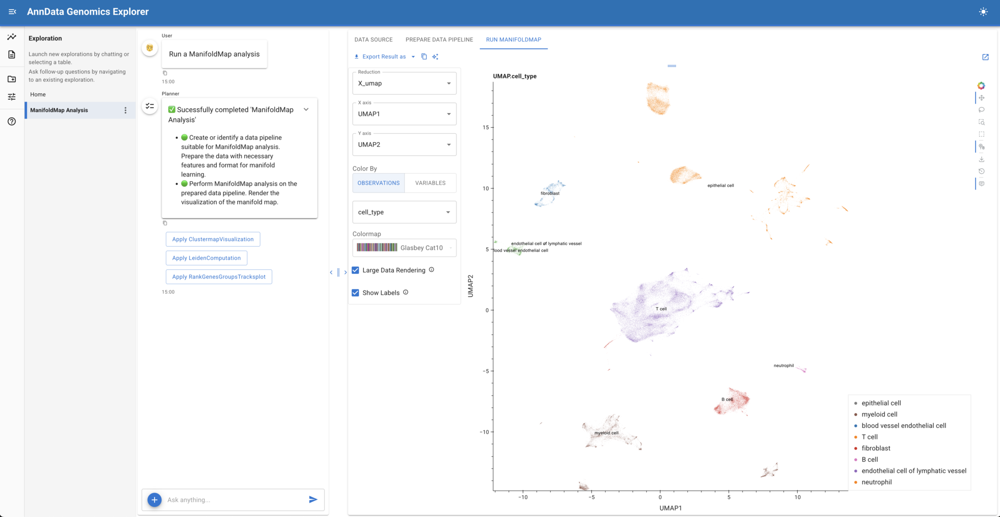



## A Major Step Toward Structured, Auditable, AI-Driven Data Apps

When we [announced the pre-release version of Lumen AI](./lumen_ai_announcement/), our goal was ambitious: build a fully open, extensible framework for conversational data exploration that always remains transparent, inspectable, and composable, rather than opaque, closed and non-extensible.

Today, with the full release of **Lumen 1.0**, that vision has been realized while also significantly evolving. This release represents a substantial re-architecture of both the UI and the core execution model, along with major improvements in robustness, extensibility, and real-world applicability.

This post highlights what has changed since the initial announcement, why those changes matter, and where we are headed next.


## What is Lumen AI?

Before diving any deeper, let's recap: Lumen AI is an open-source framework for **conversational data exploration and analysis** that combines large language models with a structured, declarative execution model. Lumen allows users to explore data, generate SQL, build transformations, and produce visualizations using natural language, while keeping every step inspectable, editable, and reproducible.

Unlike chat-only tools, Lumen is designed around **explicit data pipelines and typed execution plans**. As in a chatting tool, LLMs are used to propose transformations, analyses, and visual outputs, but in Lumen those proposals are expressed as concrete, serializable specifications that can be validated, re-run, shared, or extended with custom Python logic. Because Lumen is built on Panel and the broader HoloViz ecosystem, it can render rich interactive outputs, from tables and charts to full dashboards—directly as part of the workflow.

At its core, Lumen is much more than a chat interface over data; it is a complete framework for building **auditable, extensible, AI-assisted data applications**, where conversational exploration is the entry point rather than the end state.

## Try it out

The best way to understand what Lumen does is simply to try it out. We have provided [a deployment you can try out today](http://lumen-ai.holoviz-demo.anaconda.com/), pre-configured with a few datasets.

### Run Locally

Install it with `uv` / `pip` or `conda`:

::: {.panel-tabset}

### uv/pip

```bash
uv install 'lumen[ai-openai]'
```

### conda

```bash
conda install -c conda-forge lumen openai
```

:::

We are assuming using OpenAI here but we also [support many other LLM Providers](https://lumen.holoviz.org/configuration/llm_providers/). Next configure the `OPENAI_API_KEY` (or whatever other provider you want to use).

```bash
export OPENAI_API_KEY="sk-..."
```

Finally launch it with:

::: {.panel-tabset}

### Command Line

```bash
lumen-ai serve https://datasets.holoviz.org/penguins/v1/penguins.csv --show
```

### Python

```python
from lumen.ai import ExplorerUI

ui = ExplorerUI(
    'https://datasets.holoviz.org/penguins/v1/penguins.csv'
   )
ui.servable()
```

```bash
panel serve app.py --show
```

:::

If a browser tab doesn't automatically open, visit [https://localhost:5006](https://localhost:5006) and start chatting with your data. For more details check out our [Quickstart Guide](https://lumen.holoviz.org/quick_start/).

## A First Look at Using Lumen

A typical Lumen session starts with a question, but it does not end with a single answer.

You might begin by asking:

> *“How has monthly revenue changed by product category over the past year?”*

From there, Lumen walks through a structured flow:

1. **Interpret the intent**
   The `Planner` translates the question into a concrete plan: what data is needed, which tables to query, and how results should be grouped or aggregated.

2. **Generate and expose SQL**
   The `SQLAgent` produces a SQL query, executes it, and shows both the result and the query itself. You can inspect it, edit it, or reuse it directly.

3. **Produce a visualization**
   Based on the result, the `VegaLiteAgent` generates a Vega-Lite specification to visualize the data if needed. The specification is human-readable, visible, and editable, just like the SQL.

4. **Iterate conversationally**
   You can refine the analysis with follow-up questions—filter a category, change the aggregation, or add a comparison—and Lumen updates only the affected steps.

5. **Turn exploration into something reusable**
   At any point, the steps taken so far can become part of a report or a larger workflow, re-run against fresh data, or combined with additional analyses.

Each step produces explicit artifacts that remain part of the session, making it easy to understand how a result was produced and to build on it over time.

This makes Lumen well suited for workflows that start with open-ended exploration but need to evolve into repeatable analysis, shared reports, or hosted data applications.

## Lessons Learned

As Lumen matured, a few core lessons consistently shaped our design decisions.

**Power vs. usefulness.** We found that larger or more “reasoning-heavy” models do not necessarily lead to better outcomes. For data exploration and analysis, **low-latency models that reliably generate structured output** often outperform more complex alternatives. Fast feedback loops matter, and predictable structure, especially when generating SQL or visualization specifications, proved more valuable than extended internal reasoning.

**Humans in the loop, without the noise.** Transparency remains a core principle for Lumen, but we learned that always exposing all the details quickly becomes overwhelming. Earlier versions of the UI surfaced too much internal detail, making it harder for users to focus on results. In Lumen 1.0, we still expose **inspectable artifacts like SQL queries and Vega-Lite specs**, but by default we now deliberately hide chain-of-thought and other intermediate reasoning. The goal is to give users confidence and control without forcing them to sift through unnecessary and distracting information.

**Lean into what LLMs do well and pair it with Python.** Rather than asking models to do everything, we focused on their strengths: generating **structured, validatable outputs** and orchestrating workflows. Those outputs can then be checked, executed, and refined using deterministic systems. At the same time, Lumen makes it easy to inject **custom Python analysis code**, allowing users to bring in domain-specific logic, do complex transformations, and reuse existing libraries. This combination of LLMs for intent and structure with Python for execution and extensibility has proven to be a powerful and sustainable foundation.

## What's Changed Since the Pre-Release Announcement

Since the initial announcement, Lumen has undergone a series of substantial changes driven by real-world usage, technical constraints, and a clearer understanding of where LLMs add value in data workflows. Rather than layering features onto the original design, we revisited several core assumptions, resulting in meaningful changes to the UI, execution model, and extension points. The sections below highlight the most important improvements in Lumen 1.0, and how they move the project from an early proof of concept toward a robust and extensible foundation.

### A Complete UI Rewrite Using `panel-material-ui`

One of the biggest visible changes in Lumen 1.0 is the **full rewrite of the UI on top of [`panel-material-ui`](https://panel-material-ui.holoviz.org)** and the newly created [`panel-splitjs`](https://github.com/panel-extensions/panel-splitjs).

{fig-align="center" width="100%" fig-alt="UI Screenshot"}

The original UI proved the concept, but it was difficult to evolve, to theme consistently, or to extend cleanly. The new UI provides:

* A modern, cohesive visual design
* Better layout primitives for complex outputs
* A clearer separation between exploration, results, and controls
* A solid foundation for report and dashboard composition
* Ability to theme the UI easily

This is not just a visual refresh, it is an enabling step for everything that follows, including persistent sessions, report composition, and application-like workflows.

### From Global Memory to Explicit, Typed Context

Early versions of Lumen relied on a shared global memory object to pass information between agents and tools. While initially workable, this model made reasoning, validation, and reuse increasingly difficult as workflows became more complex.

In Lumen 1.0, we introduced a **new API based on explicit context passing**:

* Agents and tools declare **typed inputs and outputs** using Pydantic models
* Context is passed explicitly between steps rather than implicitly shared
* Chaining agents becomes auditable, testable, and predictable
* The execution graph is intelligent and automatically re-runs dependent tasks when one of its inputs changes

{fig-align="center" width="100%" fig-alt="Typed context diagram"}

This shift makes Lumen workflows easier to reason about for both humans and LLMs, while laying the groundwork for reproducibility, validation, and long-running executions.

### A New Execution Architecture and the Foundation for Reports

We also reworked how Lumen executes the plans generated by an LLM.

Instead of treating plans as ephemeral instructions, Lumen now executes them through a novel **task-oriented architecture** that can mix:

* LLM-driven steps
* Deterministic computations
* External data access
* Custom Python logic

This architecture directly powers a new **Reports capability**, where tasks can be defined declaratively and executed to produce exportable, repeatable outputs, whether or not an LLM is involved.

{fig-align="center" width="100%" fig-alt="Report structure diagram"}

The task-oriented architecture is a key step toward Lumen acting not just as a chat interface, but as a system for building structured analytical workflows (and provides the foundation for future persistence features).

### Broader Connectivity and Improved Robustness

Lumen 1.0 also significantly expands its practical reach:

* **Stronger SQL support via SQLAlchemy**, enabling many more databases out of the box
* **More flexible LLM integration**, with improved support for multiple providers and configurations
* Substantial improvements in **performance, stability, and failure handling**

These changes reflect a shift from experimentation toward production-oriented usage, especially in enterprise and research environments.

## Domain-Specific Lumen: Genomics with `lumen-anndata`

One of the main value propositions of Lumen is that it is an open, extensible, system that can be customized for your particular needs and requirements. Alongside the core Lumen 1.0 release, we have been exploring what it looks like to **tailor Lumen to specific scientific and analytical domains**. One early example of this work is **`lumen-anndata`**, a proof-of-concept integration focused on genomic and single-cell analysis workflows for the biosciences.

{fig-align="center" width="100%" fig-alt="lumen-anndata example"}

`lumen-anndata` demonstrates how Lumen can be extended beyond generic tabular data exploration by layering in domain knowledge and tooling:

* **Custom data catalogs** that connect to domain-specific sources, such as CellxGene, and load data directly from `h5ad` / AnnData files
* **Domain-specific analyses and transformations**, enabling LLM-guided workflows that understand common genomic operations rather than treating them as opaque Python code
* **Rich, specialized visual outputs**, including complex [UMAP](https://umap-learn.readthedocs.io) embeddings rendered directly within the Lumen UI and composed alongside tables, metadata, and narrative context

While still experimental, this work highlights an important aspect of Lumen’s design: the core framework is intentionally **domain-agnostic**, yet is built to support **domain-specific adaptations**. By swapping or extending data catalogs, agents, tools, and analysis steps, Lumen can similarly be shaped to fit workflows in finance, geospatial analysis, or any other specialized field.

We are actively developing additional tailored variants of Lumen along these lines. The goal is not to create a single, one-size-fits-all assistant, but a shared foundation that makes it straightforward to build **expert-oriented, auditable, AI-assisted analysis environments**, each grounded in the conventions, data formats, and best practices of its domain.

As these efforts mature, they will increasingly feed back into the core framework, strengthening Lumen as a platform for both general and highly specialized data applications.

## What’s Next

While Lumen 1.0 is a major milestone, it is not the end of the roadmap. Two major areas of active development are:

### Session Persistence and Shared Explorations

We are working toward the ability to:

* Persist user sessions
* Save and reload explorations
* Re-run analyses against fresh data
* Share explorations with others

These changes will transform Lumen from a purely interactive tool toward a collaborative, repeatable system.

### From Reports to Data Applications

Building on the new execution and reporting architecture, we plan to support:

* Polished report generation
* Grid-based, drag-and-drop layout of generated artifacts
* Composition of explorations into dashboards and data applications

The goal is to let users move seamlessly from conversational exploration to structured, deployable outputs, without ever leaving Lumen.

## Get Started with Lumen

If you are interested in structured, inspectable AI-driven data workflows, Lumen 1.0 is ready to explore.

* **Documentation:** [https://lumen.holoviz.org](https://lumen.holoviz.org)
  Installation guides, concepts, and examples to get started.

* **Source code:** [https://github.com/holoviz/lumen](https://github.com/holoviz/lumen)
  Open-source development, issue tracking, and contribution guidelines.

Lumen is still evolving, and feedback from real-world usage continues to shape its direction. If you are experimenting with conversational data exploration, reproducible analysis, or AI-assisted data applications, we encourage you to try Lumen and engage with the project. If you want our help to tailor Lumen to your domain or to interface with your company's data, reach out to us and we'd be happy to explore this with you.

## Closing Thoughts

Lumen 1.0 reflects a clear design direction: **structured over ad-hoc, explicit over implicit, auditable over opaque**. Rather than chasing fully autonomous “black box” agents, we are focused on systems that keep humans in the loop, expose their internal structure, and integrate naturally with Python and open-source tooling.

If you tried Lumen early on, this release is worth a fresh look. And if you are interested in where conversational interfaces, data applications, and open systems intersect, we would love your feedback as we continue building.
