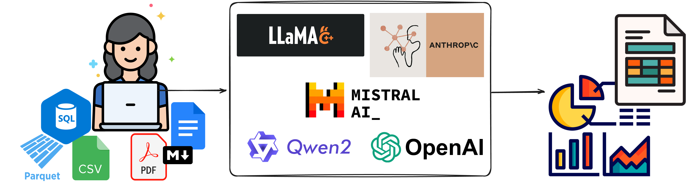
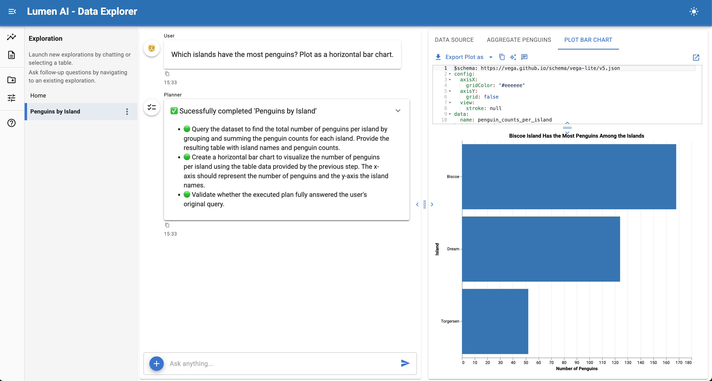



## A Major Step Toward Structured, Auditable AI-Driven Data Apps

When we [first announced Lumen AI](./lumen_ai_announcement/), our goal was ambitious: build a fully open, extensible framework for conversational data exploration that remains transparent, inspectable, and composable, rather than opaque and ad-hoc.

Today, with the release of **Lumen 1.0**, that vision has materially matured. This release represents a substantial re-architecture of both the UI and the core execution model, along with major improvements in robustness, extensibility, and real-world applicability.

This post highlights what has changed since the initial announcement, why those changes matter, and where we are headed next.

## What is Lumen AI?

Let's quickly recap the core ideas and design behind Lumen AI. Lumen AI is an open-source framework for **conversational data exploration and analysis** that combines large language models with a structured, declarative execution model. It allows users to explore data, generate SQL, build transformations, and produce visualizations using natural language, while keeping every step inspectable, editable, and reproducible.

Unlike chat-only tools, Lumen is designed around **explicit data pipelines and typed execution plans**. LLMs are used to propose transformations, analyses, and visual outputs, but those proposals are expressed as concrete, serializable specifications that can be validated, re-run, shared, or extended with custom Python logic. Because Lumen is built on Panel and the broader HoloViz ecosystem, it can render rich interactive outputs, from tables and charts to full dashboards—directly as part of the workflow.

At its core, Lumen is not just a chat interface over data, but a framework for building **auditable, extensible, AI-assisted data applications**, where conversational exploration is the entry point rather than the end state.

## Lessons Learned

As Lumen matured, a few core lessons consistently shaped our design decisions.

**Power vs. usefulness.** We found that larger or more “reasoning-heavy” models do not necessarily lead to better outcomes. For data exploration and analysis, **low-latency models that reliably follow structure** often outperform more complex alternatives. Fast feedback loops matter, and predictable structured output, especially when generating SQL or visualization specifications, proved more valuable than extended internal reasoning.

**Humans in the loop, without the noise.** Transparency remains a core principle, but we learned that exposing everything quickly becomes overwhelming. Earlier versions of the UI surfaced too much internal detail, making it harder for users to focus on results. In Lumen 1.0, we still expose **inspectable artifacts like SQL queries and Vega-Lite specs**, but we deliberately hide chain-of-thought and other intermediate reasoning (by default). The goal is to give users confidence and control without forcing them to sift through unnecessary information.

**Lean into what LLMs do well and pair it with Python.** Rather than asking models to do everything, we focused on their strengths: generating **structured, validatable outputs** and orchestrating workflows. Those outputs can then be checked, executed, and refined using deterministic systems. At the same time, Lumen makes it easy to inject **custom Python analysis code**, allowing domain-specific logic, complex transformations, and reuse of existing libraries. This combination, LLMs for intent and structure, Python for execution and extensibility, has proven to be a powerful and sustainable foundation.

## A Complete UI Rewrite on `panel-material-ui`

One of the biggest visible changes in Lumen 1.0 is the **full rewrite of the UI on top of [`panel-material-ui`](https://panel-material-ui.holoviz.org)** and the newly created [`panel-splitjs`](https://github.com/panel-extensions/panel-splitjs).

The original UI proved the concept, but it was difficult to evolve, theme consistently, or extend cleanly. The new UI provides:

* A modern, cohesive visual design
* Better layout primitives for complex outputs
* A clearer separation between exploration, results, and controls
* A foundation for report and dashboard composition
* Ability to theme the UI easily 

  
  

    <em><b>Modernized UI</b>: The new UI built on `panel-material-ui` and `panel-splitjs` with modernized menus, clearer navigation and a resizable results area.</em>
  

 

This is not just a visual refresh, it is an enabling step for everything that follows, including persistent sessions, report composition, and application-like workflows.

## From Global Memory to Explicit, Typed Context

Early versions of Lumen relied on a shared global memory object to pass information between agents and tools. While workable, this model made reasoning, validation, and reuse increasingly difficult as workflows became more complex.

In Lumen 1.0, we introduced a **new API based on explicit context passing**:

* Agents and tools declare **typed inputs and outputs** using Pydantic models
* Context is passed explicitly between steps rather than implicitly shared
* Chaining agents becomes auditable, testable, and predictable
* The execution graph is intelligent and automatically re-runs dependent tasks when one of its inputs changes

  
  

    <em><b>Context Flow</b>: A graph highlighting how context flows through a series of tasks.</em>
  

 

This shift makes Lumen workflows easier to reason about for both humans and LLMs, while laying the groundwork for reproducibility, validation, and long-running executions.

## A New Execution Architecture and the Foundation for Reports

We also reworked how Lumen executes the plans generated by an LLM.

Instead of treating plans as ephemeral instructions, Lumen now executes them through a **task-oriented architecture** that can mix:

* LLM-driven steps
* Deterministic computations
* External data access
* Custom Python logic

  
  

    <em><b>Report Structure</b>: A diagram representing the structure of a <code>Report</code> containing sections including an example of a deterministic <code>SQLAction</code> and two <code>ActorTask</code>s that invoke the <code>VegaLiteAgent</code> and <code>ChatAgent</code> respectively.</em>
  

 

This architecture directly powers a new **Reports capability**, where tasks can be defined declaratively and executed to produce exportable, repeatable outputs, whether or not an LLM is involved.

This is a key step toward treating Lumen not just as a chat interface, but as a system for building structured analytical workflows (and provides the foundation for future persistence features).

## Broader Connectivity and Improved Robustness

Lumen 1.0 also significantly expands its practical reach:

* **Stronger SQL support via SQLAlchemy**, enabling many more databases out of the box
* **More flexible LLM integration**, with improved support for multiple providers and configurations
* Substantial improvements in **performance, stability, and failure handling**

These changes reflect a shift from experimentation toward production-oriented usage, especially in enterprise and research environments.

## What’s Next

While Lumen 1.0 is a milestone, it is not the end of the roadmap. Two major areas of active development are:

### Session Persistence and Shared Explorations

We are working toward the ability to:

* Persist user sessions
* Save and reload explorations
* Re-run analyses against fresh data
* Share explorations with others

This moves Lumen from a purely interactive tool toward a collaborative, repeatable system.

### From Reports to Data Applications

Building on the new execution and reporting architecture, we plan to support:

* Polished report generation
* Grid-based, drag-and-drop layout of generated artifacts
* Composition of explorations into dashboards and data applications

The goal is to let users move seamlessly from conversational exploration to structured, deployable outputs, without leaving Lumen.

## Closing Thoughts

Lumen 1.0 reflects a clear design direction: **structured over ad-hoc, explicit over implicit, auditable over opaque**. Rather than chasing fully autonomous “black box” agents, we are focused on systems that keep humans in the loop, expose their internal structure, and integrate naturally with Python and open-source tooling.

If you tried Lumen early on, this release is worth a fresh look. And if you are interested in where conversational interfaces, data applications, and open systems intersect, we would love your feedback as we continue building.
