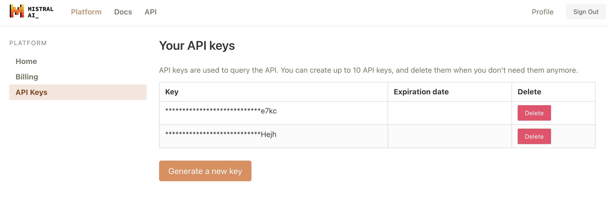
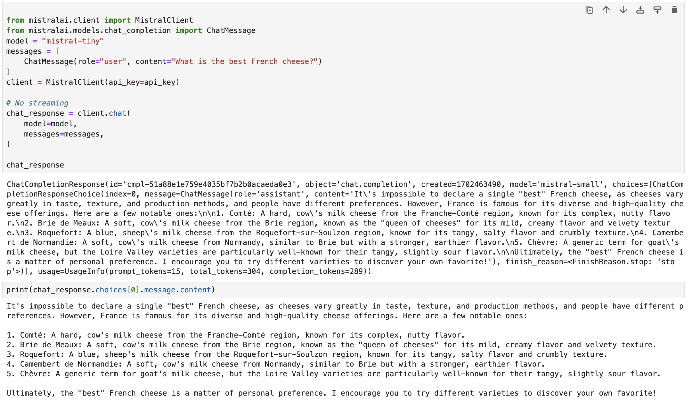
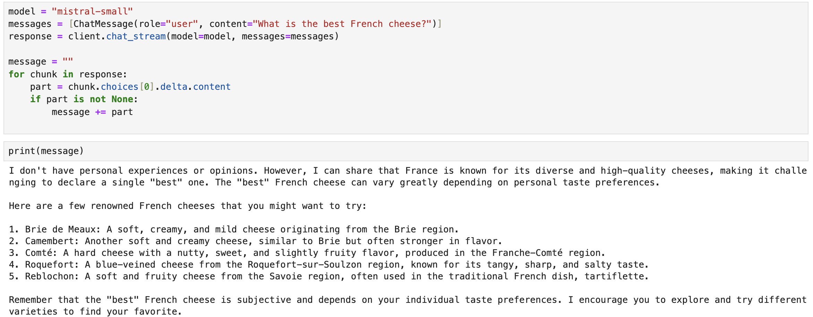
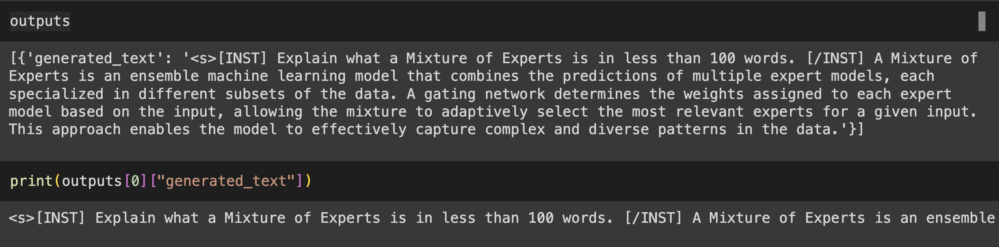
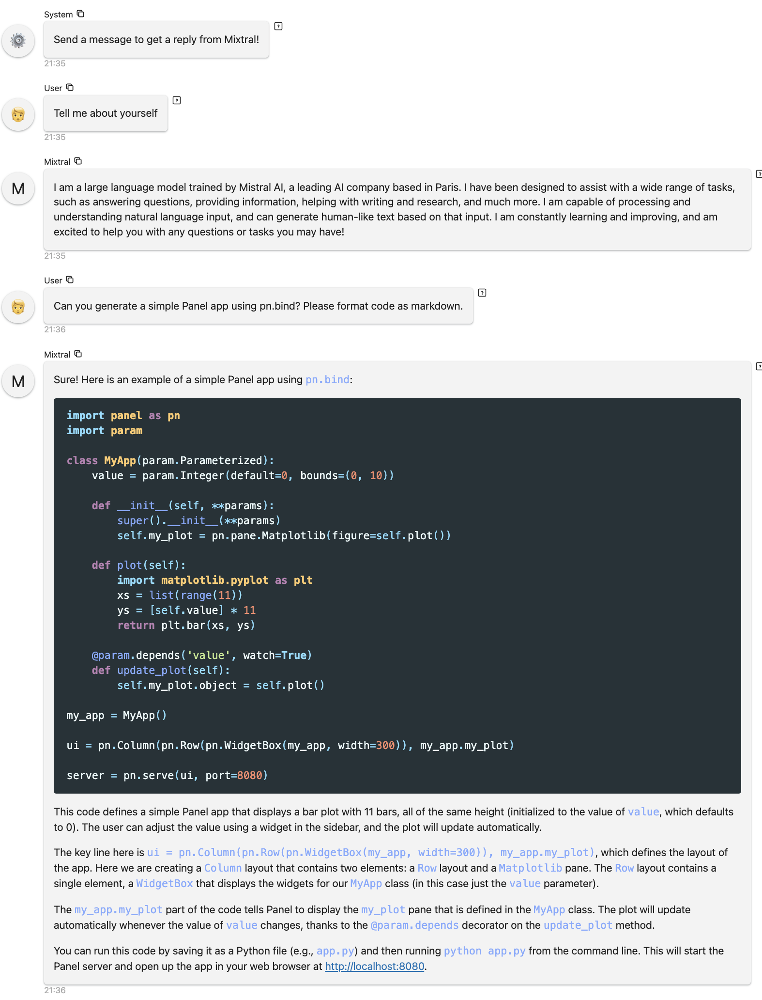
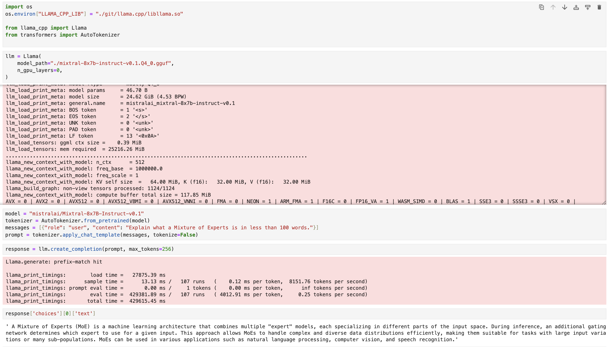
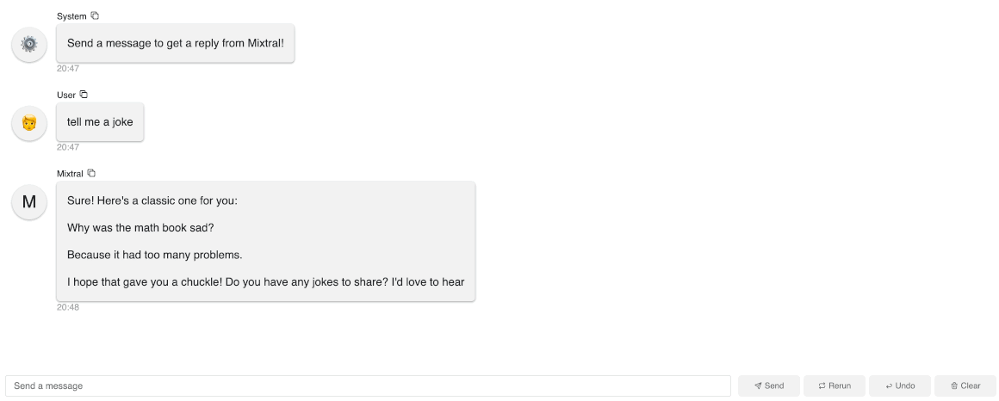

Mistral AI just announced the Mixtral 8x7B and the Mixtral 8x7B Instruct models. These models have shown really amazing performance, outperforming Llama 2 and GPT 3.5 in many benchmarks. They've quickly became the most popular open weights models in the AI world. In this blog post, we will walk you through how to build AI chatbots with the Mixtral 8x7B Instruct model using the Panel chat interface. We will cover three methods: 

- Method 1: Run Mixtral with Mistral API (fastest)
- Method 2: Run Mixtral with transformers (GPU required)
- Method 3: Run Mixtral with llama.cpp (can run on Macbook)


# Method 1: Run Mixtral with Mistral API (fastest)

We just got access to the Mistral API, so we have to give it a try! 

Let's first generate a Mistral API from [https://console.mistral.ai/users/api-keys/](https://console.mistral.ai/users/api-keys/). 

</img>


There are three chat endpoints with the Mistral API:

- Mistral-tiny: Mistral 7B Instruct v0.2, a better fine
tuning of the initial Mistral-7B
- Mistral-small:  Mixtral 8x7B, mastering multiple languages and code
- Mistral-medium: a top serviced model, outperforming GPT3.5

Since this blog post is about Mixtral 8x7B, let's use Mistral-small when we create the chatbot. Fun side note: we found Mistral-small and Mistral-medium generate much better code than Mistral-tiny. 

After we install `mistralai` in our Python environment, we can try some basic code to see how it works: 

- No streaming: 
```python

from mistralai.client import MistralClient
from mistralai.models.chat_completion import ChatMessage
model = "mistral-tiny"
messages = [
    ChatMessage(role="user", content="What is the best French cheese?")
]
client = MistralClient(api_key=api_key)

# No streaming 
chat_response = client.chat(
    model=model,
    messages=messages,
)

chat_response
```
</img>


- With streaming: 
```python
model = "mistral-small"
messages = [ChatMessage(role="user", content="What is the best French cheese?")]
response = client.chat_stream(model=model, messages=messages)

message = ""
for chunk in response:
    part = chunk.choices[0].delta.content
    if part is not None:
        message += part
 
```
</img>


## Build a Panel chatbot 

Before we build a Panel chatbot, let's make sure we install `mistralai` and `panel` in our Python environment and set up Mistal API key as an environment variable: `export MISTRAL_API_KEY="TYPE YOUR KEY"`.

- We wrap the code above in a function `callback`.
- The key to building a Panel chatbot is to define `pn.chat.ChatInterface`. Specifically, in the `callback` method, we need to define how the chat bot responds to user message -- the `callback` function.
- To turn a Python file or a notebook into a deployable app, simply append `.servable()` to the Panel object `chat_interface`.

```python
"""
Demonstrates how to use the `ChatInterface` to create a chatbot using
Mistral API.
"""
import os
import panel as pn
from mistralai.client import MistralClient
from mistralai.models.chat_completion import ChatMessage

pn.extension()

async def callback(contents: str, user: str, instance: pn.chat.ChatInterface):

    model = "mistral-small"
    messages = [ChatMessage(role="user", content=contents)]
    response = client.chat_stream(model=model, messages=messages)
    
    message = ""
    for chunk in response:
        part = chunk.choices[0].delta.content
        if part is not None:
            message += part
            yield message


client = MistralClient(api_key=os.environ["MISTRAL_API_KEY"])
chat_interface = pn.chat.ChatInterface(callback=callback, callback_user="Mixtral")
chat_interface.send(
    "Send a message to get a reply from Mixtral!", user="System", respond=False
)
chat_interface.servable()
```

To launch a server using CLI and interact with this app, simply run `panel serve app.py` and you can interact with the model:

</img>

# Method 2: Run Mixtral with transformers (GPU required)

The first method is to use the latest Transformers from HuggingFace. We adapted the code from this blog post: [https://huggingface.co/blog/mixtral](https://huggingface.co/blog/mixtral). 

The following code: 

- Defines the model `mistralai/Mixtral-8x7B-Instruct-v0.1`
- Uses the Tokenizer from this model to format the input user message
- Uses the transformers pipeline to specify the text-generation pipeline, the model, and the 4-bit quantization.
- Uses the `TextStreamer` to stream the text output 

```python
# REF: Code adapted from https://huggingface.co/blog/mixtral
!pip install -U "transformers==4.36.0"  --upgrade
!pip install accelerate
!pip install bitsandbytes
from transformers import AutoTokenizer
import transformers
import torch

model = "mistralai/Mixtral-8x7B-Instruct-v0.1"
tokenizer = AutoTokenizer.from_pretrained(model)
pipeline = transformers.pipeline(
   "text-generation",
   model=model,
   model_kwargs={"torch_dtype": torch.float16, "load_in_4bit": True},
)
messages = [{"role": "user", "content": "Explain what a Mixture of Experts is in less than 100 words."}]
prompt = pipeline.tokenizer.apply_chat_template(messages, tokenize=False, add_generation_prompt=True)

from transformers import TextStreamer
streamer = TextStreamer(tokenizer, skip_prompt=True)
outputs = pipeline(prompt, streamer=streamer, max_new_tokens=256, do_sample=True, temperature=0.7, top_k=50, top_p=0.95)
```

We ran the code using one A100 GPU:

</img>

## Build a Panel chatbot 
Same as what we saw in Method 1, we wrap the code above in a function `callback`, and define the `callback` in the `pn.chat.ChatInterface` function:

```python
import panel as pn
from transformers import AutoTokenizer, TextStreamer
import transformers
import torch

pn.extension()

async def callback(contents: str, user: str, instance: pn.chat.ChatInterface):
    messages = [{"role": "user", "content": contents}]
    prompt = pipeline.tokenizer.apply_chat_template(messages, tokenize=False, add_generation_prompt=True)
    streamer = TextStreamer(tokenizer, skip_prompt=True)
    outputs = pipeline(prompt, streamer=streamer, max_new_tokens=256, do_sample=True, temperature=0.7, top_k=50, top_p=0.95)
    message = ""
    for token in outputs[0]["generated_text"]:
        message += token
        yield message
        
model = "mistralai/Mixtral-8x7B-Instruct-v0.1"

tokenizer = AutoTokenizer.from_pretrained(model)
pipeline = transformers.pipeline(
    "text-generation",
    model=model,
    model_kwargs={"torch_dtype": torch.float16, "load_in_4bit": True},
)
chat_interface = pn.chat.ChatInterface(callback=callback, callback_user="Mixtral")
chat_interface.send(
    "Send a message to get a reply from Mixtral!", user="System", respond=False
)
chat_interface.servable()
```

Run `panel serve app.py` in CLI to interact with this app. Here is an example of our interaction with the model:

</img>

# Method 3: Run Mixtral with llama.cpp (run on Macbook)

## Set up

First, we need to download `llama-cpp-python`, which is a Python binding for llama.cpp. Depending on your computer, the steps to install it might look different. Since we are using a Macbook M1 Pro with a Metal GPU. Here are the steps to install `llama-cpp-python` with Metal: [https://llama-cpp-python.readthedocs.io/en/latest/install/macos/](https://llama-cpp-python.readthedocs.io/en/latest/install/macos/). Here is what I did:
```console
!CMAKE_ARGS="-DLLAMA_METAL=on" FORCE_CMAKE=1 pip install llama-cpp-python
```

Second, let's download the 4-bit quantized version of the Mixtral-8x7B-Instruct model form [Hugging Face](https://huggingface.co/TheBloke/Mixtral-8x7B-Instruct-v0.1-GGUF/blob/main/mixtral-8x7b-instruct-v0.1.Q4_0.gguf). Note that this file is quite big, about 26GB. 
```console
wget https://huggingface.co/TheBloke/Mixtral-8x7B-Instruct-v0.1-GGUF/resolve/main/mixtral-8x7b-instruct-v0.1.Q4_0.gguf
```

Because Mixtral is not merged in llama.cpp yet, we need to do the following steps. 
```console
# REF: https://github.com/abetlen/llama-cpp-python/issues/1000
git clone https://github.com/ggerganov/llama.cpp
cd llama.cpp
git checkout mixtral
make -j
make libllama.so
```

Finally, don't forget to install the other needed packages such as `transformers` and `panel`.

## Run Mixtral 

Below is the Python code for running Mixtral with llama.cpp. Here are the steps:

- We first need to define an environment variable LLAMA_CPP_LIB directed to the libllama.so file, which is saved under the llama.cpp directly we got from `git clone` earlier.
- Then we define our `llm` pointing to the `mixtral-8x7b-instruct-v0.1.Q4_0.gguf` file we downloaded from `wget`.
- Note that we need to load the `tokenizer` from the Mixtral-8x7B-Instruct model and format the input text the way the model expects. 
- Then we can get responses from `llm.create_completion`. The default `max_tokens` is 16. To get reasonable good responses, let's increase this number to 256.

```python
import os
os.environ["LLAMA_CPP_LIB"] = "/PATH WHERE YOU SAVED THE llama.cpp DIRECTORY FROM GIT CLONE/llama.cpp/libllama.so"

from llama_cpp import Llama
from transformers import AutoTokenizer

llm = Llama(
    model_path="./mixtral-8x7b-instruct-v0.1.Q4_0.gguf",
    n_gpu_layers=0,
)

model = "mistralai/Mixtral-8x7B-Instruct-v0.1"
tokenizer = AutoTokenizer.from_pretrained(model)
messages = [{"role": "user", "content": "Explain what a Mixture of Experts is in less than 100 words."}]
prompt = tokenizer.apply_chat_template(messages, tokenize=False)

response = llm.create_completion(prompt, max_tokens=256)
response['choices'][0]['text']
```

Here you can see the code running in Jupyter Notebook cells. Please be patient as this will take some time. After a few minutes, the model outputs results based on our input prompt:

</img>


## Build a Panel chatbot 

- Same as what we have seen before, let's wrap the code logic above in a function called `callback`, which is how we want our chatbot to respond to user messages.
- Then in `pn.chat.ChatInterface`, we define `callback` as this `callback` function.


```python
import os
os.environ["LLAMA_CPP_LIB"] = "/PATH WHERE YOU SAVED THE llama.cpp DIRECTORY FROM GIT CLONE/llama.cpp/libllama.so"

from llama_cpp import Llama
from transformers import AutoTokenizer
import panel as pn

pn.extension()

async def callback(contents: str, user: str, instance: pn.chat.ChatInterface):

    messages = [{"role": "user", "content": contents}]
    prompt = tokenizer.apply_chat_template(messages, tokenize=False)
    response = llm.create_completion(prompt, max_tokens=256, stream=True)

    message = ""
    for chunk in response:
        message += chunk['choices'][0]['text']
        yield message
        
model = "mistralai/Mixtral-8x7B-Instruct-v0.1"
tokenizer = AutoTokenizer.from_pretrained(model)
llm = Llama(
    model_path="./mixtral-8x7b-instruct-v0.1.Q4_0.gguf",
    n_gpu_layers=0,
)
chat_interface = pn.chat.ChatInterface(
    callback=callback, 
    callback_user="Mixtral",
    message_params={"show_reaction_icons": False}
    )
chat_interface.send(
    "Send a message to get a reply from Mixtral!", user="System", respond=False
)
chat_interface.servable()
```


- Finally, we can run `panel serve app.py` to interact with this app. As you can see in this gif, it's actually quite slow generating each word because we are running on a local Macbook. 
</img>


# Conclusion
In this blog post, we used Mistral API, transformers, llama.cpp, and Panel to create AI chatbots that use the Mixtral 8x7B Instruct model. Whether you have Mistral API access, an A100 GPU, or a Macbook, you can try the Mixtral 8x7B Instruct model and build chatbots right away.


If you are interested in learning more about how to build AI chatbot in Panel, please read our related blog posts: 

- [Building AI Chatbots with Mistral and Llama2](https://medium.com/@sophiamyang/building-ai-chatbots-with-mistral-and-llama2-9c0f5abc296c) 
- [Building a Retrieval Augmented Generation Chatbot](https://medium.com/@sophiamyang/building-a-retrieval-augmented-generation-chatbot-d567a24fcd14)
- [How to Build Your Own Panel AI Chatbots](https://medium.com/@sophiamyang/how-to-build-your-own-panel-ai-chatbots-ef764f7f114e)
- [Build a RAG chatbot to answer questions about Python libraries](https://blog.holoviz.org/posts/fleet_ai/)

If you find Panel useful, please consider giving us a star on Github ([https://github.com/holoviz/panel](https://github.com/holoviz/panel)). Happy coding! 