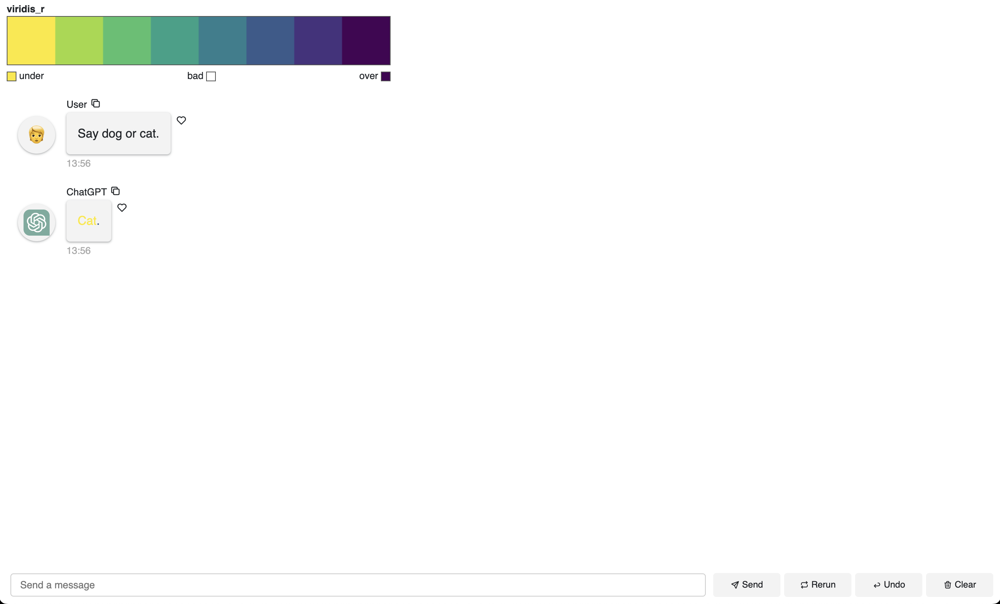

Have you ever wanted to evaluate the confidence of LLM's output? Utilize log probabilities!

## Introduction

In many cases, there's no indication of how confident the model is in its output;
LLMs simply try to generate the most likely text based on the input and the model's training data.

However, with the `logprobs` parameter, we can now visualize the confidence of the model's output.

This blog demonstrates how to **color the text based on the log probabilities of the tokens**.
The higher the log probability, the more confident the model is in the token.

This is useful if you want to...

- better understand how your system prompt is affecting the model's output
- calibrate the model's **temperature** to achieve the desired confidence level
- **filter out low-confidence** outputs to lessen hallucinations
- see whether incorporating **retrieval augmented generation (RAG)** can increase the confidence of the model's output
- evaluate whether the **model's version** affects the confidence of the output


## TLDR

Here's the full code below.

Highlights:

- Panel to create a chat interface and input widgets to control LLM's parameters
- TastyMap to generate a limited color palette to map to the log probabilities
- the `logprobs` is extracted from the model's response to use for coloring the text

Continue reading for a simple version of the following code, which additionally
features playground-like widgets to control the model's parameters and system prompt.

```python
import os
import re

import numpy as np
import panel as pn
import tastymap as tm
from openai import AsyncOpenAI

pn.extension()

COLORMAP = "viridis_r"
NUM_COLORS = 8
SYSTEM_PROMPT = """
Based on the text, classify as one of these options:
- Feature
- Bug
- Docs
Answer in one word; no other options are allowed.
""".strip()


def color_by_logprob(text, log_prob):
    linear_prob = np.round(np.exp(log_prob) * 100, 2)
    # select index based on probability
    color_index = int(linear_prob // (100 / (len(colors) - 1)))

    # Generate HTML output with the chosen color
    if "'" in text:
        html_output = f'<span style="color: {colors[color_index]};">{text}</span>'
    else:
        html_output = f"<span style='color: {colors[color_index]}'>{text}</span>"
    return html_output


def custom_serializer(content):
    pattern = r"<span.*?>(.*?)</span>"
    matches = re.findall(pattern, content)
    if not matches:
        return content
    return matches[0]


async def respond_to_input(contents: str, user: str, instance: pn.chat.ChatInterface):
    if api_key_input.value:
        aclient.api_key = api_key_input.value
    elif not os.environ["OPENAI_API_KEY"]:
        instance.send("Please provide an OpenAI API key", respond=False, user="ChatGPT")

    # add system prompt
    if system_input.value:
        system_message = {"role": "system", "content": system_input.value}
        messages = [system_message]
    else:
        messages = []

    # gather messages for memory
    if memory_toggle.value:
        messages += instance.serialize(custom_serializer=custom_serializer)
    else:
        messages.append({"role": "user", "content": contents})

    # call API
    response = await aclient.chat.completions.create(
        model=model_selector.value,
        messages=messages,
        stream=True,
        logprobs=True,
        temperature=temperature_input.value,
        max_tokens=max_tokens_input.value,
        seed=seed_input.value,
    )

    # stream response
    message = ""
    async for chunk in response:
        choice = chunk.choices[0]
        content = choice.delta.content
        log_probs = choice.logprobs
        if content and log_probs:
            log_prob = log_probs.content[0].logprob
            message += color_by_logprob(content, log_prob)
            yield message


tmap = tm.cook_tmap(COLORMAP, NUM_COLORS)
colors = tmap.to_model("hex")

aclient = AsyncOpenAI()
api_key_input = pn.widgets.PasswordInput(
    name="API Key",
    placeholder="sk-...",
    width=150,
)
system_input = pn.widgets.TextAreaInput(
    name="System Prompt",
    value=SYSTEM_PROMPT,
    rows=1,
    auto_grow=True,
)
model_selector = pn.widgets.Select(
    name="Model",
    options=["gpt-3.5-turbo", "gpt-4"],
    width=150,
)
temperature_input = pn.widgets.FloatInput(
    name="Temperature", start=0, end=2, step=0.01, value=1, width=100
)
max_tokens_input = pn.widgets.IntInput(name="Max Tokens", start=0, value=256, width=100)
seed_input = pn.widgets.IntInput(name="Seed", start=0, end=100, value=0, width=100)
memory_toggle = pn.widgets.Toggle(
    name="Include Memory", value=False, width=100, margin=(22, 5)
)
chat_interface = pn.chat.ChatInterface(
    callback=respond_to_input,
    callback_user="ChatGPT",
    callback_exception="verbose",
)

pn.Column(
    pn.Row(
        api_key_input,
        system_input,
        model_selector,
        temperature_input,
        max_tokens_input,
        seed_input,
        memory_toggle,
        align="center",
    ),
    pn.Row(tmap._repr_html_(), align="center"),
    chat_interface,
).show()
```

## Building the app

To get started, I usually envision the key components of the app and then build them out one by one.

As the first step, let's try to extract the log probabilities from the model's streaming response.

```python
from openai import AsyncOpenAI

aclient = AsyncOpenAI()

async def get_log_probs(contents: str):
    response = await aclient.chat.completions.create(
        model="gpt-3.5-turbo",
        messages=[{"role": "user", "content": contents}],
        stream=True,
        logprobs=True,
    )

    token_log_probs = {}
    async for chunk in response:
        choice = chunk.choices[0]
        content = choice.delta.content
        log_probs = choice.logprobs
        if content and log_probs:
            log_prob = log_probs.content[0].logprob
            token_log_probs[content] = log_prob
    return token_log_probs

log_probs = await get_log_probs("Say dog or cat.")
log_probs
```

Output: `{'Dog': -0.32602254, '.': -0.4711762}`

These are the log probabilities of the tokens in the response, but they are not exactly intuitive.

We can convert these log probabilities to linear probabilities using this formula.

```python

import numpy as np

for token, log_prob in log_probs.items():
    linear_prob = np.round(np.exp(log_prob) * 100, 2)
    print(f"{token}: {linear_prob}%")
```

Output:
```
Dog: 72.18%
.: 62.43%
```

Now that we have the linear probabilities, we can map them to a color palette using TastyMap.

Let's first try coloring some text in Panel.

```python
import panel as pn

pn.extension()

text = "This is a test sentence."
color = "red"
html_output = f"<span style='color: {color}'>{text}</span>"
pn.pane.Markdown(html_output)
```


Great, the text is now colored in red.

With that knowledge, we can map the linear probabilities to a color palette using TastyMap and
display the colorbar.

```python

import panel as pn
import tastymap as tm

pn.extension()

COLORMAP = "viridis_r"
NUM_COLORS = 8

def color_by_logprob(text, log_prob):
    linear_prob = np.round(np.exp(log_prob) * 100, 2)
    # select index based on probability
    color_index = int(linear_prob // (100 / (len(colors) - 1)))

    # Generate HTML output with the chosen color
    if "'" in text:
        html_output = f'<span style="color: {colors[color_index]};">{text}</span>'
    else:
        html_output = f"<span style='color: {colors[color_index]}'>{text}</span>"
    return html_output


tmap = tm.cook_tmap(COLORMAP, NUM_COLORS)
colors = tmap.to_model("hex")
html = ""
for token, log_prob in log_probs.items():
    html += color_by_logprob(token, log_prob)

pn.Column(tmap._repr_html_(), pn.pane.HTML(html))
```

Next, we can link everything together in a simple chat interface using Panel.

Use the `callback` keyword argument to specify the function that will handle the user's input.

Here, we use the `respond_to_input` function to handle the user's input, which

- sends the user's input to the OpenAI API
- receives the model's response
- extracts the log probabilities from the response
- colors the text based on the log probabilities
- yields (streams) the colored text back to the chat interface

```python
import panel as pn
import tastymap as tm

pn.extension()

COLORMAP = "viridis_r"
NUM_COLORS = 8

def color_by_logprob(text, log_prob):
    linear_prob = np.round(np.exp(log_prob) * 100, 2)
    # select index based on probability
    color_index = int(linear_prob // (100 / (len(colors) - 1)))

    # Generate HTML output with the chosen color
    if "'" in text:
        html_output = f'<span style="color: {colors[color_index]};">{text}</span>'
    else:
        html_output = f"<span style='color: {colors[color_index]}'>{text}</span>"
    return html_output

async def respond_to_input(contents: str, user: str, instance: pn.chat.ChatInterface):
    response = await aclient.chat.completions.create(
        model="gpt-3.5-turbo",
        messages=[{"role": "user", "content": contents}],
        stream=True,
        logprobs=True,
    )

    message = ""
    async for chunk in response:
        choice = chunk.choices[0]
        content = choice.delta.content
        log_probs = choice.logprobs
        if content and log_probs:
            log_prob = log_probs.content[0].logprob
            message += color_by_logprob(content, log_prob)
            yield message

tmap = tm.cook_tmap(COLORMAP, NUM_COLORS)
colors = tmap.to_model("hex")

chat_interface = pn.chat.ChatInterface(
    callback=respond_to_input,
    callback_user="ChatGPT",
    callback_exception="verbose",
)
chat_interface.send("Say dog or cat.")
pn.Column(
    tmap._repr_html_(),
    chat_interface,
    align="center",
).servable()
```



## Conclusion

Congrats! You've built a chat interface that colors the text based on the log probabilities of the tokens in the model's response.

Feel free to study the code above and modify it to suit your needs; in the TLDR section, I have additionally added widgets to control the model's parameters and system prompt!

If you are interested in learning more about how to build AI chatbots in Panel, please read our related blog posts: 

- [Build a Mixtral Chatbot with Panel](https://blog.holoviz.org/posts/mixtral/)
- [Building AI Chatbots with Mistral and Llama2](https://medium.com/@sophiamyang/building-ai-chatbots-with-mistral-and-llama2-9c0f5abc296c) 
- [Building a Retrieval Augmented Generation Chatbot](https://medium.com/@sophiamyang/building-a-retrieval-augmented-generation-chatbot-d567a24fcd14)
- [How to Build Your Own Panel AI Chatbots](https://medium.com/@sophiamyang/how-to-build-your-own-panel-ai-chatbots-ef764f7f114e)
- [Build a RAG chatbot to answer questions about Python libraries](https://blog.holoviz.org/posts/fleet_ai/)
- [Build an AI Chatbot to Run Code and Tweak plots](https://blog.holoviz.org/posts/tweak-mpl-chat/)

If you find Panel useful, please consider giving us a star on Github ([https://github.com/holoviz/panel](https://github.com/holoviz/panel)). If you have any questions, feel free to ask on our [Discourse](https://discourse.holoviz.org/). Happy coding!