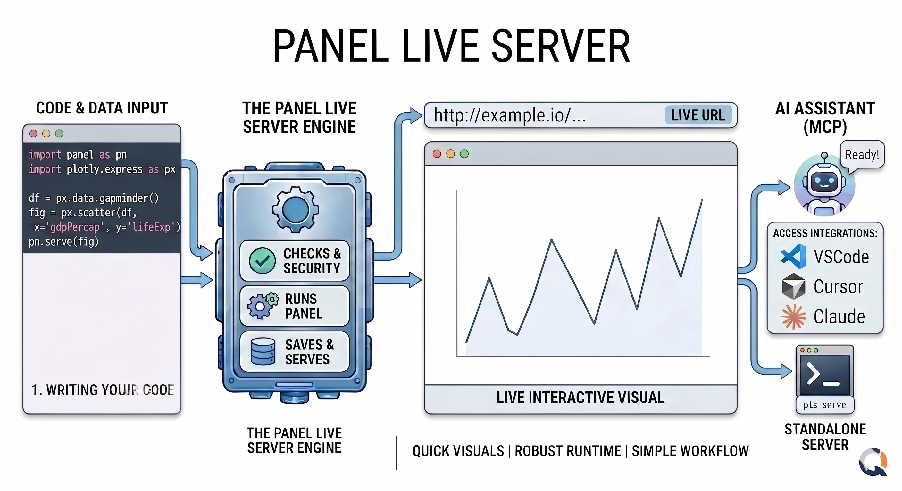
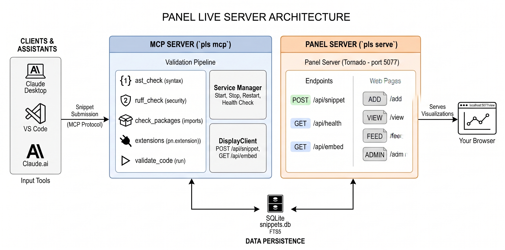

<style>
.quarto-title-meta-contents p:not(.date) {
    font-weight: 700;
}

strong code, b code {
    font-weight: 700;
}
</style>

## A Faster Path from Code to Visualization

Anyone who has built interactive data applications with Panel, hvPlot, or HoloViews knows the workflow: write code, spin up a server, open a browser, refresh, repeat. For quick experiments and exploratory work, that loop adds up. And if you are working inside an AI assistant, asking Claude or GitHub Copilot to help you build a chart, there has been no clean way to actually *see* the result without leaving your tool.

**Panel Live Server** removes that friction. When connected to an MCP-compatible AI assistant like Claude, VS Code, or Cursor via the [Model Context Protocol (MCP)](https://modelcontextprotocol.io/), you can point it at a dataset file or a URL and ask for a visualization directly in the chat. The assistant generates the code, Panel Live Server executes it, and the result comes back as a live, interactive visualization rendered inline in the chat via iframe, without leaving your IDE. You can also use it standalone from the terminal, submitting code through a browser UI and getting a persistent URL back instantly.



## What is Panel Live Server?

Panel Live Server (`panel-live-server`) is an open-source local web server built around Panel. You submit Python code, anything from a simple chart to a full Panel dashboard, and it renders the output as a persistent, interactive web page. Every snippet gets its own URL stored in a SQLite database, so your visualizations survive server restarts and can be revisited or shared.

It is designed for two distinct use cases:

### 1. MCP Server

Give Claude, GitHub Copilot, Cursor, or any MCP-compatible AI assistant the ability to render visualizations directly in your IDE. Once connected, the assistant gains access to four tools, intended to be used in order:

- **`list_packages`**: lists the Python packages installed in the server environment. Called once at the start of a session so the AI knows exactly what libraries it can use before writing any code.
- **`validate`**: validates code before rendering. Runs five checks in sequence: syntax, security, package availability, Panel extension declarations, and a runtime execution test. Returns a structured error with recovery hints on failure, or caches the result on success so `show` can reuse it at zero cost.
- **`show`**: executes the code and renders it as a live, interactive visualization, returning a URL. The user gets a real interactive page, not a static image.
- **`screenshot`**: captures a PNG of an already-rendered visualization and returns it to the AI. This lets the model answer visual questions ("which bar is tallest?", "what color is X?") from the actual rendered pixels, not just the source code.

The image below shows the MCP server connected in a VS Code IDE, rendering a visualization directly in the chat:



Once hooked up with an MCP client such as Claude, GitHub Copilot, or Cursor, just ask:

> "Please show a quick and beautiful Matplotlib trading dashboard"
>
> "Please show a basic, interactive Panel app with a slider"
>
> "Please show the most beautiful matplotlib plot"

The AI calls `show` to render it and the visualization appears immediately in your chat interface, no manual setup required.

### 2. Standalone Server

Start a local web server and create interactive visualizations through a browser UI or REST API. Every snippet gets its own permanent URL.

The video below shows the standalone server running locally, with code submitted through the browser UI and rendered as an interactive web page instantly:



To get the server started, run:

```bash
pls serve
```

Open `http://localhost:5077/add` and submit any Python visualization:

```python
import pandas as pd
import hvplot.pandas

df = pd.DataFrame({'Product': ['A', 'B', 'C', 'D'], 'Sales': [120, 95, 180, 150]})
df.hvplot.bar(x='Product', y='Sales', title='Sales by Product')
```

Browse your visualizations at `/feed`, manage them at `/admin`, and link directly to any individual chart at `/view?id=...`.

## Try it Out

**What You'll Need**

- Python 3.12 or later
- A package manager: uv, pip (built into Python), or pixi

Install Panel Live Server using `pip`, `uv`, or `pixi`:

::: {.panel-tabset}

### pip
```bash
pip install "panel-live-server[pydata]"
```

### uv
```bash
uv tool install "panel-live-server[pydata]"
```

### pixi
```bash
pixi add --pypi "panel-live-server[pydata]"
```

:::

Then launch it:

```bash
# Standalone browser mode
pls serve

# MCP mode for AI assistants
pls mcp
```

## Connect to your MCP Client

::: {.panel-tabset}

### VS Code

Add to `.vscode/mcp.json` (create if it doesn't exist):

```json
{
  "servers": {
    "panel-live-server": {
      "type": "stdio",
      "command": "/path/to/pls",
      "args": ["mcp"]
    }
  }
}
```

::: {.callout-note appearance="simple"}
Replace `"command": "/path/to/pls"` with the path printed by `which pls`
:::

Once connected, ask your AI: *"Show me a scatter plot of this data using the show tool."*

### Cursor

Add to `~/.cursor/mcp.json`:

```json
{
  "mcpServers": {
    "panel-live-server": {
      "command": "/path/to/pls",
      "args": ["mcp"]
    }
  }
}
```

::: {.callout-note appearance="simple"}
Replace `"command": "/path/to/pls"` with the path printed by `which pls`
:::

Open Cursor Settings → MCP and verify the green dot. Use Agent mode in chat.

### Claude Desktop

Add to `claude_desktop_config.json`:

```json
{
  "mcpServers": {
    "panel-live-server": {
      "command": "/path/to/pls",
      "args": ["mcp"]
    }
  }
}
```

::: {.callout-note appearance="simple"}
Replace `"command": "/path/to/pls"` with the path printed by `which pls`
:::

### Claude Code

```bash
claude mcp add panel-live-server -- /path/to/pls mcp
```

::: {.callout-note appearance="simple"}
Replace `/path/to/pls` with the path printed by `which pls`
:::

Once connected, ask your AI: *"Show me a scatter plot of this data using the show tool."*

### claude.ai

claude.ai requires HTTP transport and a public URL. You can use any tunneling service (ngrok, Cloudflare, localhost.run, etc.). This example uses Cloudflare.

**Terminal 1** — start the MCP server:

```bash
/path/to/pls mcp --transport http --port 8001
```

::: {.callout-note appearance="simple"}
Replace `/path/to/pls` with the path printed by `which pls`
:::

**Terminal 2** — tunnel for the MCP server:

```bash
cloudflared tunnel --url http://localhost:8001
```

**Terminal 3** — tunnel for the Panel server:

```bash
cloudflared tunnel --url http://localhost:5077
```

Stop Terminal 1, set the Panel tunnel URL, and restart:

```bash
export PANEL_LIVE_SERVER_EXTERNAL_URL=<url-from-terminal-3>
/path/to/pls mcp --transport http --port 8001
```

Then go to claude.ai → Settings → Connectors → Add custom connector and enter `<url-from-terminal-2>/mcp` as the URL.

Once connected, ask your AI: *"Show me a scatter plot of this data using the show tool."*

:::

## Architecture

Panel Live Server uses a two-process architecture:



- **MCP Server (`pls mcp`)**: hosts the `list_packages`, `validate`, `show`, and `screenshot` MCP tools, starts the Standalone Server as a subprocess, and manages its lifecycle.
- **Standalone Server (`pls serve`)**: executes Python code and serves visualizations as web pages. Exposes a REST API and four browser-accessible pages.
- **Browser**: displays visualizations and management interfaces.

### The `show` Tool

The `show` MCP tool is the primary interface for AI assistants. When called:

1. The AI sends Python code via the `show` tool
2. The MCP server validates the code (syntax, imports, test execution)
3. The MCP server POSTs the snippet to the Panel server's `/api/snippet` endpoint
4. The Panel server stores the snippet in SQLite and returns a URL
5. The MCP server returns the URL to the AI assistant
6. The user accesses the visualization via URL in the browser (or inline in the MCP App UI)

```python
show(
    code="df.hvplot.bar(x='Product', y='Sales')",
    name="Sales Chart",
    description="Bar chart of product sales",
    method="inline",
    zoom=75
)
```

The tool accepts:

- **`code`** (required): Python code to execute
- **`name`**: human-readable title
- **`description`**: one-sentence explanation
- **`method`**: execution method: `"inline"` (default) or `"server"`
- **`zoom`**: initial zoom level: 25, 50, 75, or 100

### The `screenshot` Tool

The `screenshot` tool lets the AI see how a visualization actually looks in the browser. When called:

1. The AI passes the `snippet_id` returned by `show`
2. A headless Chromium browser navigates to the snippet's `/view` page
3. It waits for the content to mount and for Bokeh to finish painting
4. A PNG image is captured and returned to the AI (not the user)

```python
screenshot(
    snippet_id="abc123",
    width=1200,
    height=800,
    full_page=False
)
```

The tool accepts:

- **`snippet_id`** (required): the ID of an already-rendered snippet from `show`
- **`width`**: browser viewport width in pixels (default 1200)
- **`height`**: browser viewport height in pixels (default 800)
- **`full_page`**: if `True`, captures the full scrollable page instead of just the viewport

The screenshot goes to the AI, not the user. The user already has the live interactive visualization. This tool exists so the model can answer visual questions ("which bar is tallest?", "what color is X?") from the actual rendered pixels rather than re-deriving answers from raw data.

### Why an Independent Panel Server?

Running visualizations in an independent subprocess provides several key benefits:

- **Isolation**: if visualization code crashes or hangs, it does not affect the MCP server or the AI assistant's session. Errors are captured and returned as structured messages.
- **Decoupling**: the Panel server and MCP server are independent. You can restart, update, or reconfigure the Panel server without restarting the MCP session.
- **State management**: the Panel server maintains its own SQLite database. Visualizations persist across MCP sessions and are accessible even if the MCP server is stopped.
- **Resource control**: long-running visualizations or large datasets run in a separate process with their own memory space.

### Snippets and Execution Methods

A snippet is a stored code sample with metadata. Each snippet has a unique ID and URL-friendly slug, Python code, name and description, a status of `pending`, `success`, or `error`, detected package imports and Panel extensions, execution method, and timestamps.

1. **Inline method (default)**: executes code and captures the last expression, wrapping it with `pn.panel()` for display:

   ```python
   import pandas as pd
   df = pd.DataFrame({'x': [1, 2, 3], 'y': [4, 5, 6]})
   df  # This expression is displayed
   ```

   Best for data exploration, quick charts, and any Python object (DataFrames, plots, widgets).

2. **Server method**: executes code that explicitly calls `.servable()` on Panel components:

   ```python
   import panel as pn

   pn.extension()

   slider = pn.widgets.IntSlider(name='Value', start=0, end=100)
   pn.Column(slider, pn.bind(lambda x: f'{x}² = {x**2}', slider)).servable()
   ```

   Best for complex interactive applications and multi-component dashboards.

Code executes inside a `types.ModuleType` namespace registered in `sys.modules`, so Panel decorators like `@pn.cache` and `@pn.depends` work correctly, just as they do in Panel application files.

### Code Validation

Before submitting code to the Panel server, the MCP server runs a validation chain:

1. **Syntax check**: `ast.parse()` to catch syntax errors early
2. **Extension check**: verifies required Panel extensions are available (plotly, vega, deckgl, etc.)
3. **Execution test**: runs the code in a module namespace to catch runtime errors

If validation fails, a structured error message is returned with recovery suggestions, without creating a database entry.

### Persistent Storage

Every snippet is saved to a local SQLite database with full-text search. Visualizations are not ephemeral; they have stable URLs and survive server restarts. This makes it practical for building up a personal library of reusable snippets over time.

Panel Live Server adapts to where you are working:

- **Local machine**: standard `localhost:5077` setup
- **JupyterHub**: automatic URL externalization
- **GitHub Codespaces**: remote URL exposed correctly

The same `pls serve` or `pls mcp` command works across all of these, no environment-specific configuration needed.

### Browser Pages

| URL | Purpose |
|:---|:---|
| `/view?id=...` | Executes and renders a single snippet |
| `/feed` | Browse all saved visualizations |
| `/add` | Web form to create snippets manually |
| `/admin` | Management table: search, inspect, delete |

: {tbl-colwidths="[25,75]"}

## Get Started with Panel Live Server

If you are interested in faster visualization workflows or AI-assisted data exploration with real rendered outputs, Panel Live Server is ready to try.

- **Documentation:** <https://panel-extensions.github.io/panel-live-server/> Installation guides, concepts, and examples to get started.
- **Source code:** <https://github.com/panel-extensions/panel-live-server> Open-source development, issue tracking, and contribution guidelines.

Panel Live Server is actively evolving. If you are experimenting with MCP integrations, interactive dashboards, or AI-assisted visualization workflows, we encourage you to try it and share your feedback on [Discourse](https://discourse.holoviz.org) or [Discord](https://discord.gg/UXdtYyGVQX). We would love to hear how you are using it and what you would like to see next.

Thanks to [Marc Skov Madsen](https://github.com/MarcSkovMadsen) for designing and building the initial version of panel-live-server.
