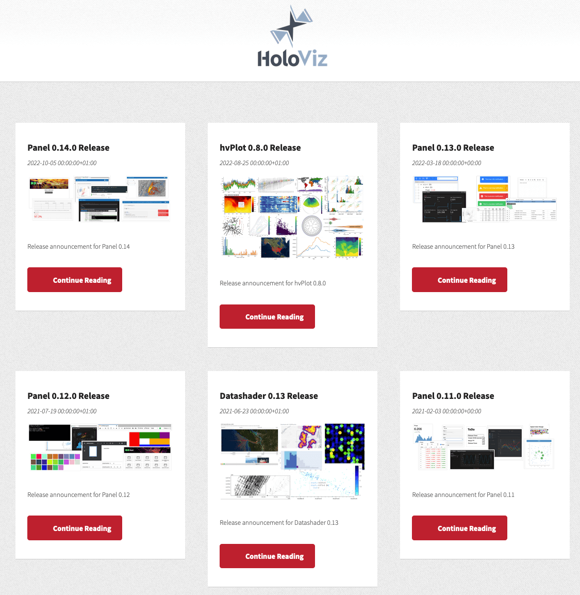
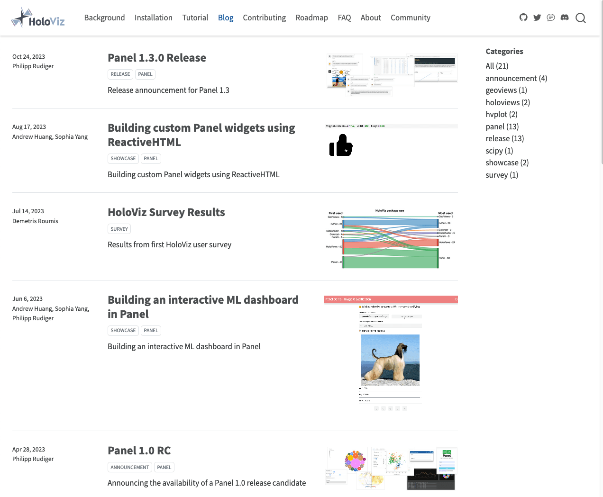

Following the tradition, we have decided that our first post after migrating to [Quarto](https://quarto.org/) would be about the migration itself!

## Why changing?

The HoloViz blog dates back to 2018 and at the time [Pelican](https://getpelican.com/) was chosen to build the site, together with the [pelican-jupyter](https://github.com/danielfrg/pelican-jupyter) plugin to add support to authoring blog posts from Jupyter Notebooks. While this combination served us well over the years, we observed that the notebook plugin was deprecated and that there was no much interest among our maintainers and contributors to update the existing site that started to show its age, so much that we weren't very motivated to write new blog posts. We were in desperate need of a change!

## Choosing a framework

One of our key requirements was to be able to build a site from Jupyter Notebooks since the HoloViz tools have first-class support for that environment and that is how we generally build our documentation websites. For that purpose we're usually using [Sphinx](https://www.sphinx-doc.org/) together with [MyST-NB](https://myst-nb.readthedocs.io/) and some other [custom extensions](https://panel.holoviz.org/how_to/wasm/sphinx.html). However, except from the [ABlog extension](https://ablog.readthedocs.io), the Sphinx ecosystem didn't seem to provide what we were looking after and ABlog itself, while being a good project, felt it wouldn't be complete enough. Besides that, there weren't many more options available, except [Quarto](https://quarto.org/)!

Quarto is a recent open-source project that was [announced](https://posit.co/blog/announcing-quarto-a-new-scientific-and-technical-publishing-system/) in July 2022 and that is sponsored by [Posit](https://posit.co/) (formerly known as RStudio). It's extending in many ways [R Markdown](https://github.com/rstudio/rmarkdown), an older project coming from the R ecosystem, adding for example support to Jupyter Notebooks. What pushed us to experiment with Quarto was that we began to hear  more and more about it from [HoloViz users](https://discord.com/channels/1075331058024861767/1088114664229064786/1104048693625229452); we wanted to make sure our tools were working well in that ecosystem and the blog seemed to be a good place to start.

We were quickly convinced that Quarto was the right choice after some experimentation: the user experience was smooth, their documentation was very clear and all in one place (unlike what we're used to in the Sphinx ecosystem, having to navigate between various extension websites) and it seemed it had all the features we were looking after. The only point that made us hesitate was that Quarto extensions have to be authored in [Lua](https://en.wikipedia.org/wiki/Lua_(programming_language)) and none of us had any experience in that language. Yet we decided that this shouldn't block us and went ahead with the migration.

## Migrating to Quarto

The migration all happened in [this PR](https://github.com/holoviz-dev/blog/pull/27):

- We had to convert the `<post>.ipynb-meta` sidecar files used by the `pelican-jupyter` files to the special header Quarto needs at the beginning of every document.
- In the notebooks themselves we had very little changes to make, except to handle nested and indented raw HTML included in Markdown cells that wasn't displayed as HTML by Quarto but partially wrapped in a `<code>` HTML element, removing the indentation fixed that (wrapping it in `:::{=html} <... :::` would also have worked).
- Since we had to move all the posts to the `/posts` directory, the links to our old blog posts changed. We set up redirect links using the `alisases` document option to preserve these old links.
- For a change compared to our old blog we went for the *default* listing layout instead of *grid*.
- We customised a little the styling to attempt to align it with the styling of other HoloViz websites.

While the migration went well and was pretty quick to complete, we listed [a few issues](https://github.com/holoviz-dev/blog/issues/34) that we might fix in future iterations. However we're not too surprised by experiencing some problems, our blog posts often contain a lot of complex HMTL and Javascript bits that aren't necessarily easy to handle.

## Easier contribution

Moving to Quarto improved the contributor experience, with a solid [VSCode extension](https://quarto.org/docs/tools/vscode.html) and a nice and fast *preview* mode, and again their excellent documentation.

We also made our infrastructure easier to manage which improved the contributor experience:

- the site is no longer hosted on AWS but on Github Pages
- a [development version](https://holoviz-dev.github.io/blog-dev/) has been deployed, it is re-built and re-deployed automatically on every *Pull Request* event
- the [main site](https://blog.holoviz.org/) is re-built and re-deployed whenever a *Pull Request* is merged

If you feel like contributing to the HoloViz blog, head over to its [Github repo](https://github.com/holoviz-dev/blog) and follow the instructions!