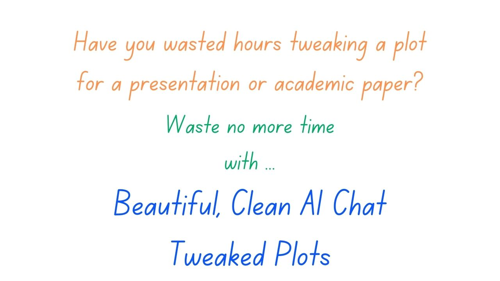
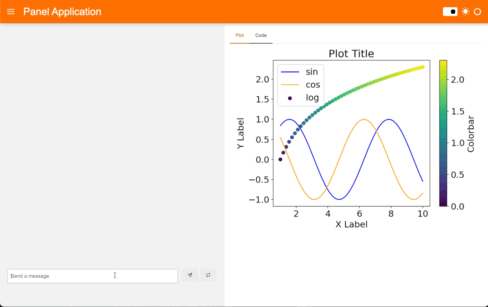
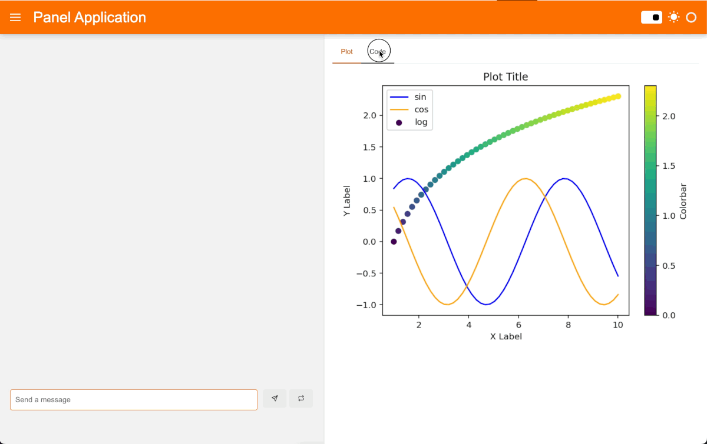
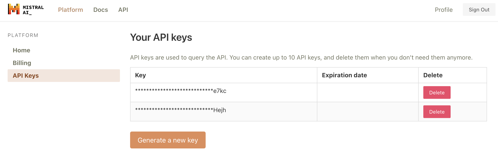
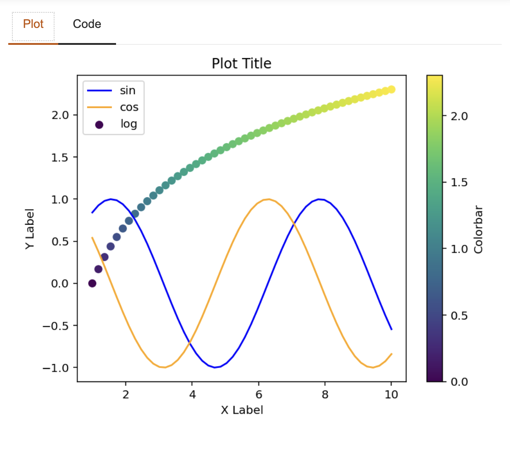
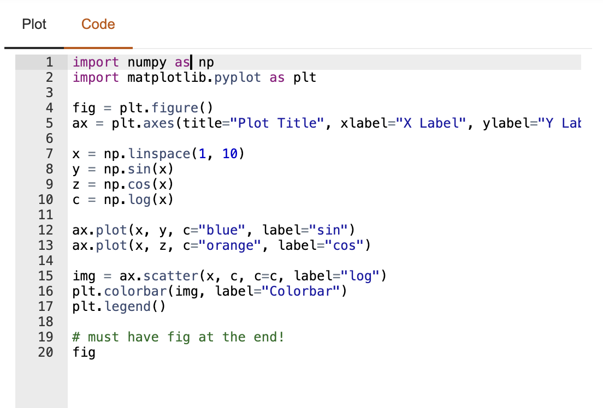

Have you wasted hours tweaking a plot for a presentation or academic paper, like searching StackOverflow on how to change the font size of the labels?
The future is now; let LLMs improve your plots for you!

</img>

In this blog post, we will build an AI chatbot with Panel and Mixtral 8x7b that will help you generate code and execute code to tweak an Matplotlib plot. It has two functionalities:

1. You can chat with the AI assistant to do small tweaks of a Matplotlib plot or ask it to "make this figure ready for a poster presentation". This is especially helpful when we need help with styling but don't know where to start. This AI chatbot will not only generate ideas, but also runnable code to improve your plot directly. 

</img>


2. You can also check the code of a figure, edit the code directly, and get the updated version of the plot. This is helpful when you would like to start with your own plot. You can copy and paste the code of your own plot here as a starting point for AI to improve. 

</img>


# Hosted App and Code 

- Try out the app [here](https://huggingface.co/spaces/ahuang11/tweak-mpl-chat) (we will keep this app live for a week)
- Check the code [here](https://huggingface.co/spaces/ahuang11/tweak-mpl-chat/blob/main/app.py)


# How to make this chatbot? 

Before we get started, let's first generate a Mistral API from [https://console.mistral.ai/users/api-keys/](https://console.mistral.ai/users/api-keys/):

</img> 

Once you have generated a key, make sure to save it as an environment variable with `export MISTRAL_API_KEY="TYPE YOUR API KEY"`. 

There are three chat endpoints with the Mistral API:

- Mistral-tiny: Mistral 7B Instruct v0.2, a better fine
tuning of the initial Mistral-7B
- Mistral-small:  Mixtral 8x7B, mastering multiple languages and code
- Mistral-medium: a top serviced model, outperforming GPT3.5

Both Mistral-small and Mistral-medium are much better at generating code than Mistral-tiny. Mistral-small responds faster and cheaper, so we will use Mistral-small. But if output quality is your priority, we definitely recommend Mistral-medium, as it generates the best code responses. 

Check out our previous blog post [Build a Mixtral Chatbot with Panel](https://blog.holoviz.org/posts/mixtral/) to see how we used Mistral API, transformers, llama.cpp, and Panel to create AI chatbots that use the Mixtral 8x7B Instruct model. 

## Step 0: Import packages 
Now let's move on to the actual code. Make sure you install the required packages `panel` and `mistralai` in your Python environment and import the needed packages: 

```python
import re
import os
import panel as pn
from mistralai.async_client import MistralAsyncClient
from mistralai.models.chat_completion import ChatMessage
from panel.io.mime_render import exec_with_return

pn.extension("codeeditor", sizing_mode="stretch_width")
```

## Step 1: Define default behaviors
Here is the [code](https://huggingface.co/spaces/ahuang11/tweak-mpl-chat/blob/main/app.py#L10-L55) for this step, we can define the following:

- The LLM model we would like to use: `LLM_MODEL="mistral-small"`
- The system message:

```markdown
You are a renowned data visualization expert
with a strong background in matplotlib.
Your primary goal is to assist the user
in edit the code based on user request
using best practices. Simply provide code 
in code fences (```python). You must have `fig`
as the last line of code
```

- The format of user content where we combine the user message the the current Python code. 
- The default Matplotlib plot that users see when they interact with the chatbot.

Feel free to change any of these default settings according to your own use cases. 


## Step 2: Define the `callback` function

This function defines how our chatbot responds to user messages. This code looks a little more complex than our examples in previous blog posts because the AI need to respond not only the text, but also the code. 
- We keep all the message history as a list in `messages`
- When users send a message, we combine both the text of the message and the current state of the code from the `code_editor` widget (see Step 3) as add to the `messages` list. 
- We send all these messages to the Mistral model.
- Then we extract Python code from the model output and update the Python code in `code_editor`.  


```python
client = MistralAsyncClient(api_key=os.environ["MISTRAL_API_KEY"])

async def callback(content: str, user: str, instance: pn.chat.ChatInterface):
    # system
    messages = [SYSTEM_MESSAGE]

    # history
    messages.extend([ChatMessage(**message) for message in instance.serialize()[1:-1]])

    # new user contents
    user_content = USER_CONTENT_FORMAT.format(
        content=content, code=code_editor.value
    )
    messages.append(ChatMessage(role="user", content=user_content))

    # stream LLM tokens
    message = ""
    async for chunk in client.chat_stream(model=LLM_MODEL, messages=messages):
        if chunk.choices[0].delta.content is not None:
            message += chunk.choices[0].delta.content
            yield message

    # extract code
    llm_code = re.findall(r"```python\n(.*)\n```", message, re.DOTALL)[0]
    if llm_code.splitlines()[-1].strip() != "fig":
        llm_code += "\nfig"
    code_editor.value = llm_code
```

## Step 3: Define widgets

1. `ChatInterface`: Panel provides a built-in `ChatInterface` widget that provides a user-friendly front-end chatbot interface for various kinds of messages.`callback` points to the function that we defined in the last step. It executes when a user sends a message.

```python
chat_interface = pn.chat.ChatInterface(
    callback=callback,
    show_clear=False,
    show_undo=False,
    show_button_name=False,
    message_params=dict(
        show_reaction_icons=False,
        show_copy_icon=False,
    ),
    height=700,
    callback_exception="verbose",
)
```

2. `matplotlib_pane` is a Panel object that shows the Matplotlib plot from the Python code. How does execute Python code and return and return the plot? The secret is the `exec_with_return` function, which will executes a code snippet and returns the resulting output. By default, `matplotlib_pane` executes the default Matplotlib code we defined in Step 1. 

``` python
matplotlib_pane = pn.pane.Matplotlib(
    exec_with_return(DEFAULT_MATPLOTLIB),
    sizing_mode="stretch_both",
    tight=True,
)
```

</img>

3. `code_editor` is another Panel object that allows embedding a code editor. 

``` python
code_editor = pn.widgets.CodeEditor(
    value=DEFAULT_MATPLOTLIB,
    sizing_mode="stretch_both",
)
```
</img>

### How does the plot get updated? 
Whenever the code changes, the plot gets updates. Specifically, the `matplotlib_pane` watches for the code changes in `code_editor` using the `param.watch` method. 

``` python 
# watch for code changes
def update_plot(event):
    matplotlib_pane.object = exec_with_return(event.new)
code_editor.param.watch(update_plot, "value")

```

So when does the code get updated? 

- Whenever the AI assistant outputs Python code, this Python code will become the new value of `code_editor`. This is defined in the `callback` function in Step 2. 
- Whenever we change code directly in the `code_editor`, the code will change and the plot will update automatically. 

## Step 4: Define layout 

Finally we can define how we'd like each widget to place in our app. 

```python
# lay them out
tabs = pn.Tabs(
    ("Plot", matplotlib_pane),
    ("Code", code_editor),
)

sidebar = [chat_interface]
main = [tabs]
template = pn.template.FastListTemplate(
    sidebar=sidebar,
    main=main,
    sidebar_width=600,
    main_layout=None,
    accent_base_color="#fd7000",
    header_background="#fd7000",
)
template.servable()
```

Then run `panel serve app.py` to launch a server using CLI and interact with this app.

# Conclusion

If you use Python to visualize data, it'd be nice if an AI chatbot can help you write Python code and improve your visualization automatically. Scientists and researchers can focus on the actual information of the visualization and let AI help with styling and others. This blog walks through how to build such an AI chatbot with Panel and Mixtral 8x7b. We hope you find this chatbot and this tutorial helpful!  

If you are interested in learning more about how to build AI chatbot in Panel, please read our related blog posts: 

- [Build a Mixtral Chatbot with Panel](https://blog.holoviz.org/posts/mixtral/)
- [Building AI Chatbots with Mistral and Llama2](https://medium.com/@sophiamyang/building-ai-chatbots-with-mistral-and-llama2-9c0f5abc296c) 
- [Building a Retrieval Augmented Generation Chatbot](https://medium.com/@sophiamyang/building-a-retrieval-augmented-generation-chatbot-d567a24fcd14)
- [How to Build Your Own Panel AI Chatbots](https://medium.com/@sophiamyang/how-to-build-your-own-panel-ai-chatbots-ef764f7f114e)
- [Build a RAG chatbot to answer questions about Python libraries](https://blog.holoviz.org/posts/fleet_ai/)

If you find Panel useful, please consider giving us a star on Github ([https://github.com/holoviz/panel](https://github.com/holoviz/panel)). If you have any questions, feel free to ask on our [Discourse](https://discourse.holoviz.org/). Happy coding! 
